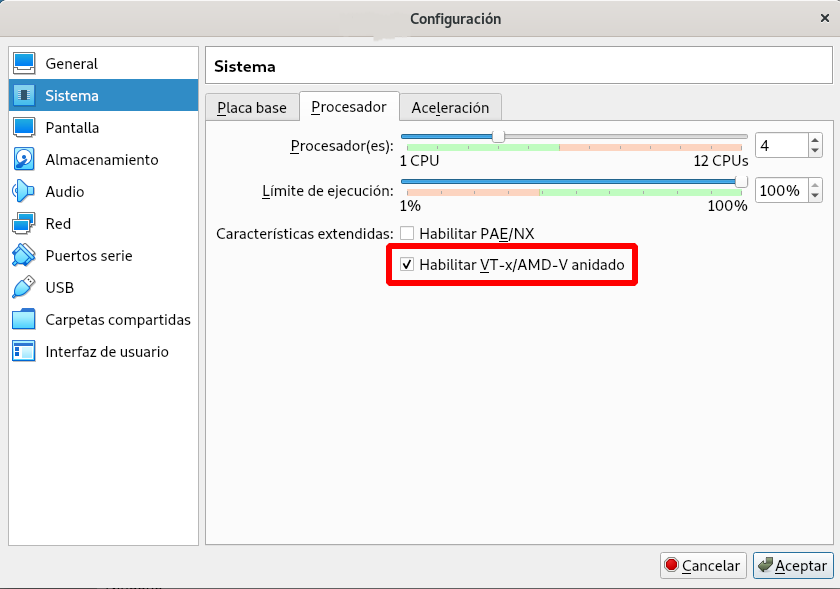
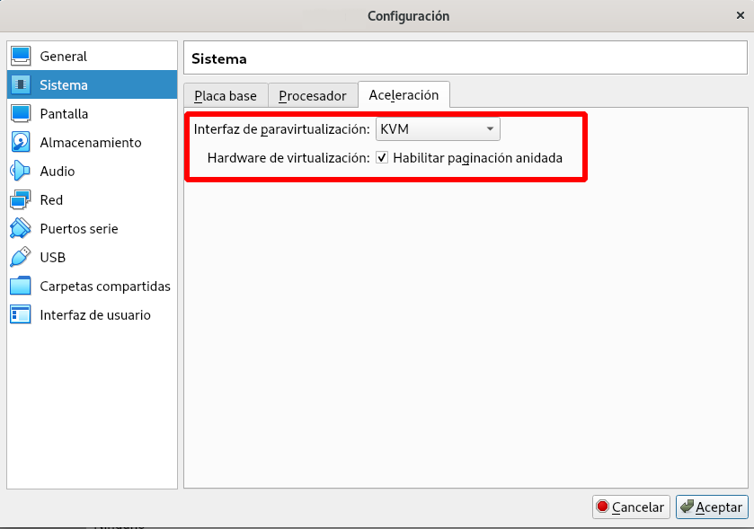

# Preparación del escenario de instalación

En un entorno de producción, QEMU/KVM se instalará sobre una máquina física con suficientes recursos. Para ejecutar QEMU/KVM necesitamos que el procesador soporte extensiones de virtualización en su juego de instrucciones. Para comprobar si tenemos esta característica ejecutamos la siguiente instrucción como `root`:

```
egrep 'svm|vmx' /proc/cpuinfo --color
```

El resultado debería mostrar varias líneas con el texto buscado resaltado en color. Si este es el caso entonces nuestro procesador soporta KVM. Los procesadores Intel mostrarán el texto **vmx** resaltado y los procesadores AMD mostrarán el texto **svm** resaltado.

**NOTA: Es importante comprobar que en la BIOS están activados las instrucciones virtuales VT/x, de lo contrario KVM no funcionará.**

## Virtualización anidada

Con esta característica se permite la ejecución de instrucciones KVM dentro de máquinas virtuales, lo cual nos posibilita la ejecución de máquinas virtuales dentro de máquinas virtuales. De esta manera, podemos crear un laboratorio de prueba de QEMU/KVM ejecutándolos en una máquina virtual.

Por ejemplo podemos activar la virtualización anidada (nested virtualization) en VirtualBox de la siguiente manera: en **Sistema-Procesador**:



Si además queremos mejora el rendimiento de la máquina virtual al optimizar la gestión de la memoria virtual, tenemos que elegir las siguientes opciones:



## Requerimientos mínimos

Como hemos visto, si tenemos un entorno de producción, utilizaremos una máquina física para la instalación de QEMU/KVM. Para realizar este curso, también podríamos usar una máquina virtual (con virtualización anidada activa) para tener un laboratorio de pruebas.

Dependiendo de la cantidad de memoria RAM, espacio de disco duro y CPU que tengamos, podremos virtualizar más o menos máquinas virtuales:

* Por ejemplo, desde el punto de vista de la RAM: si virtualizamos una máquina virtual Linux sin entorno gráfico, podemos asignarle 512Mb, si tiene entorno gráfico ya tendríamos que usar 1 o 2GB, si virtualizamos una máquina Windows al menos tendremos que asignar 2Gb de RAM.
* Desde el punto de vista del almacenamiento: Este factor no es tan importante, pero tenemos que pensar que hay que almacenar las ISO para la instalación de las máquinas y los discos duros de las máquinas virtuales. 
* Al crear máquinas virtuales podremos asignarle cores virtuales de CPU, por lo que aumentará el rendimiento si asignamos a nuestra máquina virtual suficientes núcleos de CPU.

Por todo lo explicado a continuación la configuración recomendada para la máquina virtual sería:

* **8 Gb de RAM**
* **100 Gb de disco duro**
* **4 núcleos de CPU**

