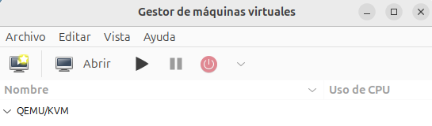

# Instalación de virt-manager

[virt-manager](https://virt-manager.org/) es una aplicación gráfica de escritorio para gestionar máquinas virtuales a través de libvirt. Presenta una vista resumida de las máquinas virtuales en ejecución, su rendimiento en vivo y las estadísticas de utilización de recursos. Los usuarios pueden crear nuevas máquinas virtuales y configurarlas y gestionar sus dispositivos de hardware. Además, poseer un cliente VNC / SPICE que permite el acceso de forma sencilla a la consola de la máquina.

En sistemas operativos basados en Debian / Ubuntu, simplemente ejecutamos:

```
apt install virt-manager
```

Por dependencias se instalarán los paquetes necesarios para instalar WEMU, KVM y libvirt.

## Configuración inicial

Como veremos a continuación, vamos a usar una conexión local privilegiada a libvirt, es decir, vamos a gestionar los recursos virtualizados usando el usuario con privilegios.

Para que nuestro usuario sin privilegio pueda usar este tipo de conexión debemos asegurarnos de que pertenece al grupo `libvirt`, para realizar esta comprobación ejecutamos la siguiente instrucción con nuestro usuario sin privilegio:

```
group
```

Y comprobamos que en la lista de grupos aparece `libvirt`. 
Si no pertenece a dicho grupo lo añadimos:

```
sudo usermod -aG libvirt $USER
newgrp libvirt
```

La última instrucción nos permite aplicar los cambios sin reiniciar la máquina.

## Vista general de virt-manager



