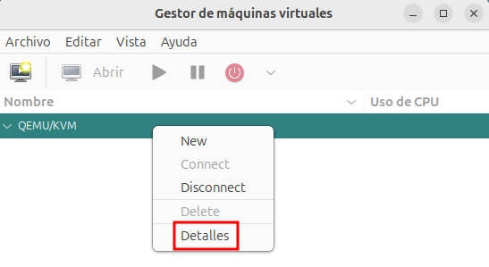
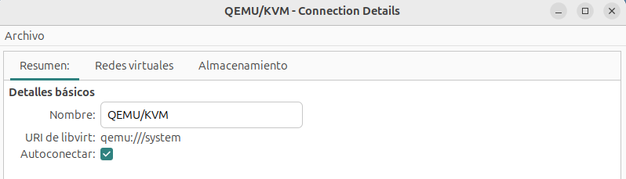

# Tipos de conexiones a libvirt

libvirt proporciona varios mecanismos para conectarse a un hipervisor QEMU/KVM:

* **Conexión local no privilegiada a libvirt**: Esta conexión permite a un usuario sin privilegios gestionar máquinas virtuales en su propio entorno sin necesidad de permisos de root. En este modo los usuarios sin privilegios pueden gestionar máquinas virtuales, pero no tienen acceso a características avanzadas, por ejemplo la gestión de redes virtuales.

    * URL de conexión: `qemu:///session`.

* **Conexión local privilegiada a libvirt**: Este método permite a un usuario con permisos de superusuario administrar todas las máquinas virtuales del sistema. Es el modo más común en servidores o entornos de producción.

    * URL de conexión: `qemu:///system`.

* **Conexión remota a libvirt**: Este método permite administrar un hipervisor QEMU/KVM en otro equipo a través de la red. Se usa en entornos de gestión centralizada o administración remota. Se pueden usar varios protocolos para el acceso, pero el más común es ssh.

    * URL de conexión: `qemu+ssh://<usuario>@<dirección  máquina remota>/system`.

## Tipo de conexión en virt-manager

Pode defecto, podemos ver que virt-manager tiene configurado una conexión local privilegiada que se llama **QEMU/KVM**. 

Con la opción **Archivo->Nueva conexión...** podemos dar de alta una nueva conexión.

Si pulsamos con el botón derecho del ratón sobre la conexión QEMU/KVM, además de distintas opciones, como *Nueva*, *Desconectar*,..., encontramos la opción **Detalles** (esta opción también se puede elegir en el menú **Editar -> Detalle de la conexión**):

Al elegir el detalle de la conexión, podemos comprobar que es una conexión local privilegiada. Nos conectamos a la URI `qemu:///system`. Además está configurada para que se conecte de forma automática cada vez que iniciamos la aplicación:

