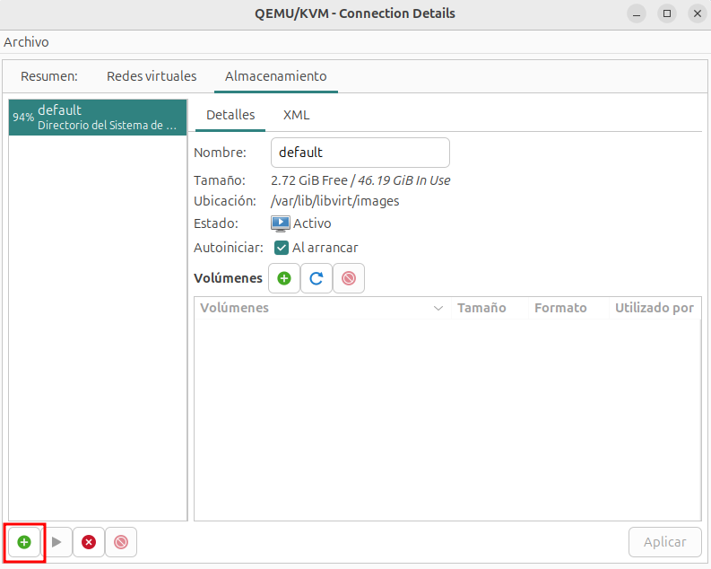

# Recursos disponibles en virt-manager

Además en los detalles de la conexión **QEMU/KVM** podemos gestionar las redes virtuales y el almacenamiento disponible:

## Redes disponibles

Podemos ver las redes creadas, crear nuevas redes, eliminarlas, modificarlas, ... Vemos que tenemos creada la red `default`.

Esta red es de tipo **NAT** y sus características son las siguientes:

* Las máquinas virtuales conectadas a esta red estarán conectada a un **red privada** con un direccionamiento privado.
* El host será la **puerta de enlace** de las máquinas virtuales conectadas a esta red y se conectará a estas máquinas usando un **brigde virtual**.
* El host funcionara como un **router** que realizará un proceso de NAT para que las máquinas virtuales tengan acceso al exterior.
* El host proporciona un **servidor DHCP** que configurará de forma automática las máquinas virtuales que estén conectada a ella.
* El host proporcionará un **servidor DNS** que las máquinas virtuales utilizarán para la resolución de nombres.

## Almacenamiento disponible

Otro elemento que podemos gestionar son los grupos de almacenamiento que tenemos en la conexión. Por defecto tenemos un grupo llamado `default`, donde se guardaban las imágenes de discos. En un primer momento cada grupo corresponde a un directorio de nuestro sistema de fichero. El grupo `default` corresponde al directorio `/var/lib/libvirt/images` que es el directorio donde se guardarán los ficheros correspondientes a las imágenes de los discos de las máquinas virtuales.

### Creación de un nuevo grupo de almacenamiento

Para que virt-manager acceda a los ficheros de nuestro sistema de fichero tenemos que crear grupos de almacenamiento. Por ejemplo, para que podamos acceder a los ficheros iso que utilizaremos para la instalación de las máquinas virtuales, vamos a crear un nuevo grupo que llamaremos `isos` que corresponda, por ejemplo, al directorio `~/Descargas/isos`. Para realizar esta operación:

1. Pulsamos el botón de añadir grupo:

    

2. Indicamos un nombre, el tipo de grupo, en nuestro caso **dir: Directorio del Sistema de Archivos** (podemos comprobar que en realidad un grupo de almacenamiento puede ser otro tipo de elemento según el tipo de almacenamiento que estemos utilizando) y el directorio al que vamos a acceder.

    

Finalmente tenemos nuestros dos grupos de almacenamiento:

