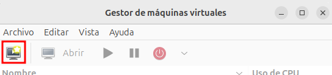
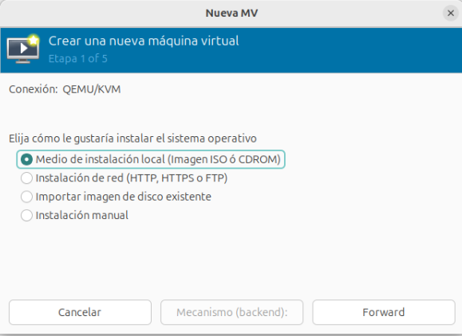
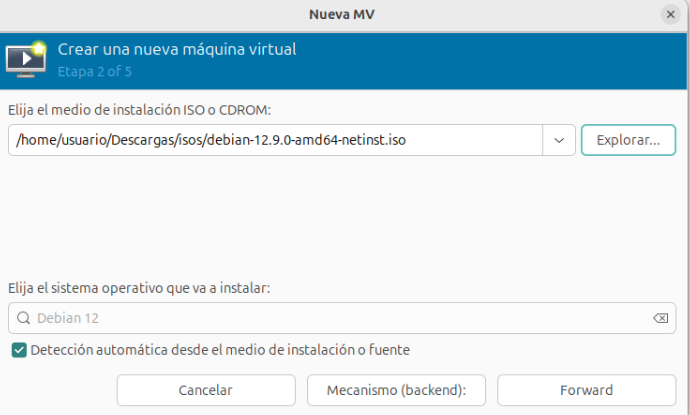
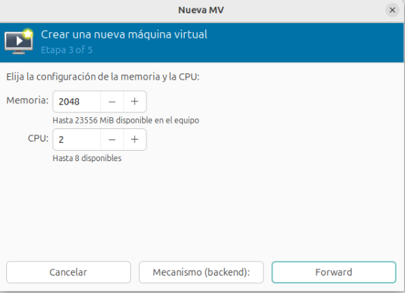
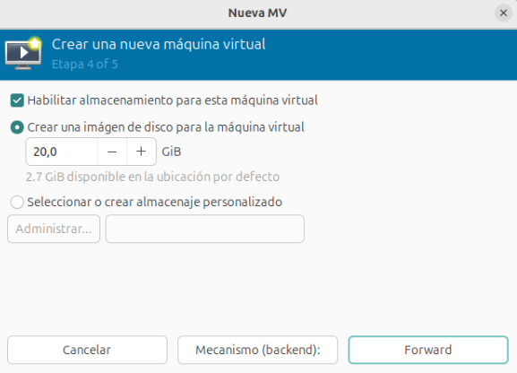
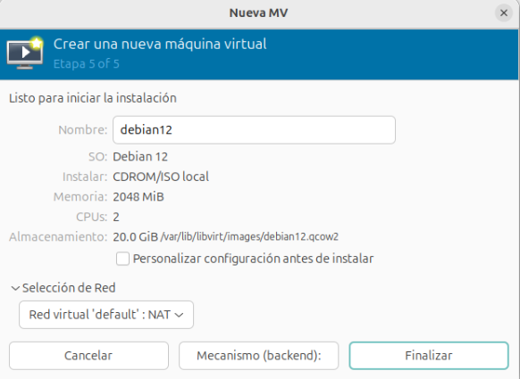
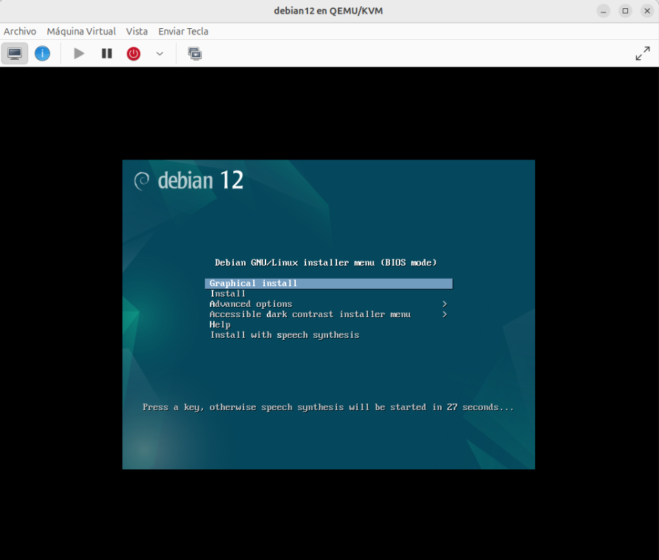

# Creación de máquinas virtuales Linux

Vamos a estudiar los pasos fundamentales para la creación de una máquina virtual. En este caso vamos a crear una máquina virtual con el sistema operativo GNU/Linux Debian. 

Antes de empezar la creación de la nueva máquina, hemos copiado en el grupo de almacenamiento **isos** (directorio `~/Descargas/isos`) una imagen ISO para la instalación de Debian:

Para crear una nueva máquina virtual con virt-manager podemos escoger la opción de menú **Archivo -> Nueva máquina virtual**, o el botón del menú:

A continuación seguimos los pasos del asistente para la creación de la máquina virtual:

## Elegir la fuente de instalación del sistema operativo

Elegimos como fuente de instalación: **instalación local desde una imagen ISO** que se montará en un CDROM.

## Seleccionar la ISO de instalación

Elegimos fichero ISO desde donde vamos a realizar la instalación. Si no se detecta la variante del sistema operativo, tenemos que añadirla manualmente escogiendo la versión más parecida a la que vamos a instalar.
La variante del sistema operativo sirve para realizar una configuración por defecto de la máquina dependiendo del sistema que vamos a instalar.

## Configuración de memoria y de VCPU

A continuación, asignamos la memoria y el número de vCPU a la nueva máquina que estamos creando.

## Seleccionar almacenamiento

En este paso, habilitamos el almacenamiento para la nueva máquina, indicando el tamaño del disco.

## Resumen y selección de red

Por último, aparece un resumen de las características de la máquina que vamos a crear. Además, podemos indicar el nombre y seleccionar la red a la que queremos que se conecte (en nuestro caso, la red de tipo NAT `default`). Si la red no está activa, nos dará la opción de activarla. Ademas podemos elegir una opción para *Personalizar la configuración antes de instalar*. 

## Comenzamos la instalación

Al pulsar el botón **Finalizar**, se crea la máquina, se inicializa y se abre la consola para que podamos empezar la instalación.

