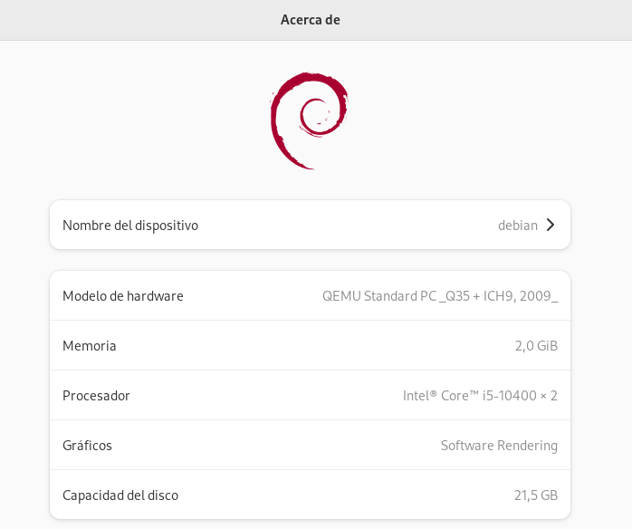

# Características de las máquinas virtuales

Después de instalar nuestra primera máquina, podemos comprobar las características con las que se ha creado:

## Red

La máquina que hemos creado se conecta, por defecto, a la red `default`. Esta red es de tipo NAT, y comprobamos que la máquina ha recibido una IP de forma dinámica y que su puerta de enlace corresponde a la dirección IP `192.168.122.1`, que corresponde con el host, el servidor DNS corresponde a la misma IP y comprobamos que tiene resolución y acceso a internet. Para ver esta información accedemos a la configuración de la red cableada:

Y además, podemos comprobar que la máquina tiene acceso a internet:

## Recursos hardware

Podemos comprobar el modelo de procesador, el tamaño de la memoria y la capacidad del disco, entrando en la opción **Acerca de** dentro de la configuración:

