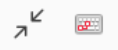
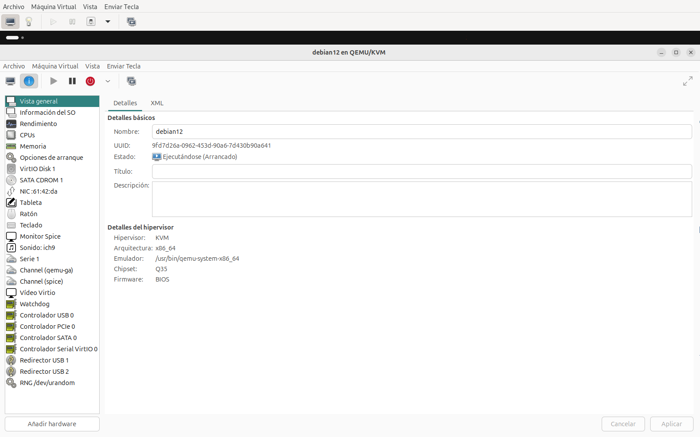
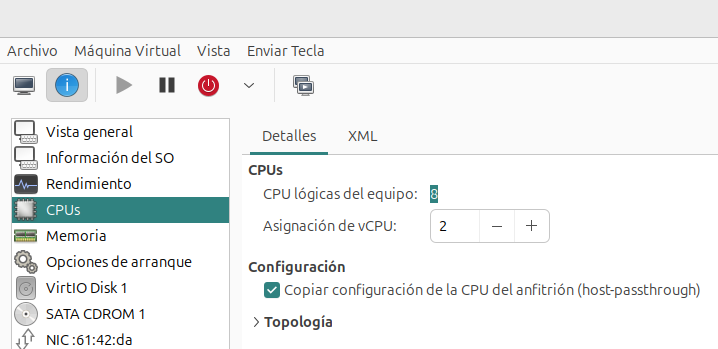

# Detalles de las máquinas virtuales

Podemos acceder al detalle de una máquina virtual de tres formas distintas: haciendo **doble clic** sobre la máquina, escogiendo la máquina y pulsando el botón **Abrir** o escogiendo la opción del menú **Editar -> Detalles de la máquina virtual**.

Accedemos a una ventana con las siguientes opciones:

* **Archivo**: Opciones generales: ver el gestor, cerrar la ventana,...
* **Máquina Virtual**: Opciones para gestionar la máquina. Además de las opciones que ya hemos estudiado, nos encontramos dos nuevas:
    * **Captura de pantalla**: Nos permite guardar una imagen de la pantalla actual.
    * **Redirigir dispositivo USB**: nos permite pasar a la máquina virtual cuelquiera de los dispositivo USB que tenemos conectado al host, por ejemplo una impresora.
* **Vista**: Nos permite ver las distintas vistas, controlar la ventana de la consola (pantalla completa, escalar, ...). Veamos las vistas:
	* **Consola**: Accedemos a una consola donde controlamos la máquina virtual. También se accede con el **botón 1**.
	* **Detalles**: Obtenemos la configuración de la máquina virtual y los dispositivos hardware. Podemos quitar y añadir nuevos dispositivos y hacer las modificaciones necesarias. También se accede con el **botón 2**.
	* **Instantáneas**: Ventana para gestionar las instantáneas de la máquina virtual. Estudiaremos más adelante las instantáneas. También se accede con el **botón 3**.
    * **Pantalla completa**: Nos permite visualizar la consola en modo pantalla completa. También se accede con el **botón 4**. Para salir de la pantalla completa nos posicionamos en la parte superior de la pantalla y aparecen dos iconos: el primero nos permite salir de la pantalla completa y el segundo nos permite enviar una tecla.

        
    * **Reducir a MV**: Configura la el tamaño de la ventana para que se adapte al la resolución de la máquina virtual.
    * **Escala monitor**: Ofrece distintas opciones para escalar la consola al tamaño de la ventana.
    * **Consolas**: Nos permite elegir a la consola que nos queremos conectar: 
        * Consola gráfica Spice: es la opción por defecto y se comporta como si estuviéramos accediendo a la máquina usando un monitor, 
        * Serie 1: Nos conectamos a la máquina usando el puerto serie.
    * **Autoconectar**: Nos permite conectar a la consola de forma automática.
* **Enviar Tecla**: Combinación de teclas que podemos enviar a la máquina virtual.

## Vista Consola

Accedemos a una consola desde donde podemos controlar la máquina virtual. Desde el menú **Vista** podemos configurar el tamaño de la pantalla (pantalla completa, escalar monitor, ...). Podemos usar esta vista para interactuar con la máquina, pero es recomendable utilizar distintos protocolos para el acceso y gestión de la máquina virtual (SSH, VCN, RDP,...)

## Vista Detalles

En esta vista se nos muestra la definición de la máquina virtual de forma gráfica. Además, nos posibilita hacer cambios en la configuración de la misma. Vemos la configuración general de la máquina y las características de los dispositivos hardware que tiene configurada. Podemos quitar dispositivos y añadir otros nuevos.

Veamos los elementos fundamentales:

* **Vista general**: Nos da la información general de la máquina virtual. 

Además, en todo momento podemos acceder a la definición XML:

* **CPUs**: Configuración de las vCPU asignadas a la máquina. Podemos modificar este valor. Si la máquina está ejecutándose la modificación será efectiva en el siguiente arranque de la máquina.

* **Memoria**: Del mismo modo, vemos la configuración de asignación de memoria RAM de la máquina. Podemos modificar la **memoria actual** y la **memoria máxima**. Del mismo modo, necesitamos reiniciar la máquina para que tenga efecto el cambio.

* **Opciones de arranque**: Podemos ver y configurar el orden de los dispositivos de arranque.

A continuación se nos muestra los distintos dispositivos hardware que tiene configurado la máquina: unidades de disco, interfaces de red, teclado, ratón, adaptador de vídeo, interfaces, ... Pudiendo hacer también, modificaciones en los mismos. Veamos algunos de ellos:

* **Discos**: Nos da información del disco que tiene configurada la máquina. Es importante, como ya hemos indicado anteriormente, que el driver sea VirtIO para obtener mayor rendimiento. Vemos que podemos añadir a las máquinas virtuales tantos discos como sean necesarios.

* **Interfaces de red**: Obtenemos la información de las distintas interfaces de red de la máquina. En este caso también usamos VirtIO como modelo de dispositivo. Vemos a qué red está conectada. Si la máquina se está ejecutando, podemos ver la dirección IP de la interfaz. Del mismo modo, los cambios serán efectivos tras el reinicio de la máquina.

Por último, tenemos dos operaciones relacionadas con los dispositivos hardware:

* Si seleccionamos uno de ellos, y pulsamos el botón derecho del ratón nos da la posibilidad de **Eliminar Hardware**.
* Con el botón **Agregar Hardware**, tenemos la posibilidad de añadir nuevos componentes a la configuración de la máquina. Hay que indicar que algunos dispositivos se pueden agregar "en caliente", con la máquina en estado de ejecución. En los próximos apartados del curso usaremos esta opción para añadir nuevos componentes a nuestras máquinas virtuales.

