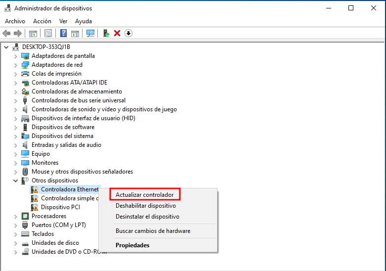
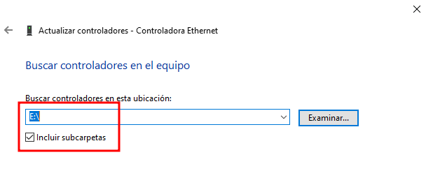
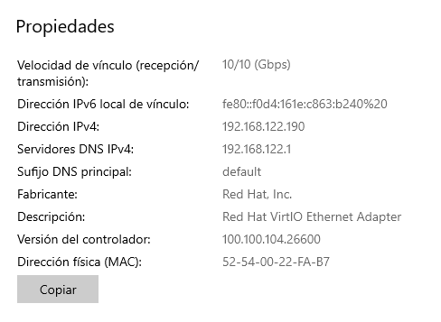
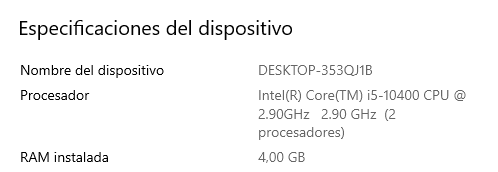
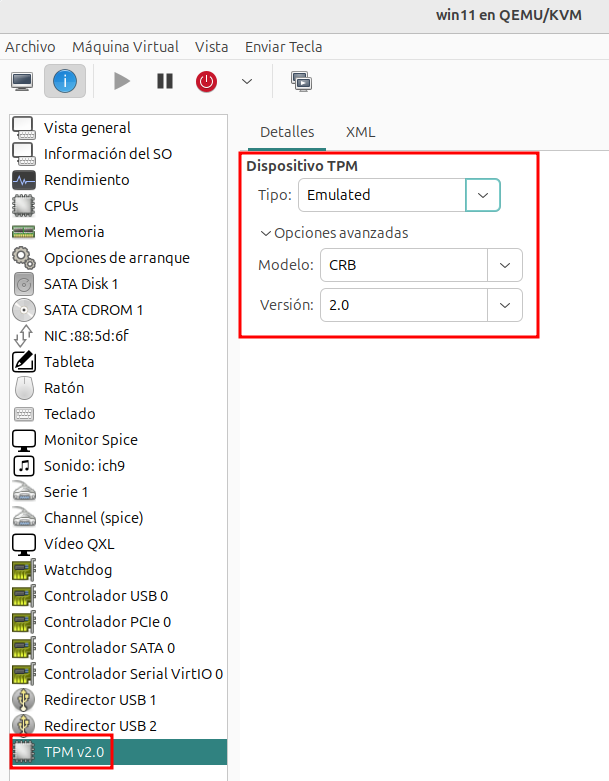

# Creación de máquinas virtuales Windows (2ª parte)

## Configuración de la red

Una vez que hemos realizado la instalación del sistema operativo, podemos comprobar que la máquina no tiene acceso a internet, ya que tenemos que cargar los drivers de la tarjeta de red VirtIO que hemos configurado.

Para ello, actualizamos el controlador del dispositivo **Controladora Ethernet** en el **Administrador de dispositivos**:

Y escogemos la unidad del CDROM donde hemos montado los drivers VirtIO y elegimos la opción **Incluir subcarpetas** para que la busque de manera recursiva (los drivers de la tarjeta de red se encuentra en la carpeta `NetKVM\<carpeta con el nombre de tu versión de windows>\amd64`):

## Configuración de otros elementos hardware de la máquina

Usando el mismo procedimiento, configuramos los drivers de los elementos hardware que nos están dando alguna indicación de error en la configuración:

* Controladora simple de comunicaciones PCI, que corresponde a un dispositivo **VirtIO Serial Driver**, que es un controlador de comunicaciones serie.
* Dispositivo PCI, que corresponde a un dispositivo **VirtIO Balloon Driver**, que es un controlador que permite la gestión dinámica de la memoria en máquinas virtuales QEMU/KVM.

## Características de las máquina Windows que hemos creado

Podemos comprobar que nuestra máquina se ha conectado a la red privada de tipo NAT llamada `default`, recibiendo una dirección IP dinámica con la siguiente configuración. Para ver la configuración: **Configuración - Red e Internet - Estado - Propiedades**:

Además, podemos comprobar que tenemos acceso a internet.

También podemos comprobar el modelo del procesador, el tamaño de la memoria y otros datos en la opción **Sistema**:

## Instalación de Windows 11

La instalación de Windows 11, es similar a la que hemos visto anteriormente con Windows 10, pero teniendo en cuenta algunas consideraciones:

* Evidentemente necesitamos guardar la imagen iso de Windows 11 en el grupo de almacenamiento **isos**, es decir, en el directorio `~/Descargas/isos`.

    

* Cuando se detecta o elegimos la variante *Microsfot Windows 11*, **virt-manager** va a configurar la máquina virtual con los elementos hardware necesarios para la instalación de este sistema operativo. En particular, se añade un dispositivo TPM. El TPM (Trusted Platform Module) es un chip de seguridad que se encuentra en la placa base de los ordenadores modernos. Su función principal es proporcionar un entorno seguro para almacenar claves de cifrado, credenciales y otros datos sensibles. Microsoft exige TPM versión 2.0 como requisito obligatorio para la instalación de Windows 11 debido a motivos de seguridad. En **virt-manager** se puede emular el chip TPM para que el sistema invitado (por ejemplo, Windows 11) lo detecte y pueda instalarse sin problemas.

    

* Para la instalación de Windows 11 es necesario que este conectado a internet. Por lo tanto **no vamos a modificar** la configuración de la tarjeta de red para indicar que sea de tipo VirtIO. El cambio lo haremos posteriormente a la instalación y evidentemente, tendremos que cargar el driver de la tarjeta de red desde la ISO de los drivers VirtIO.

