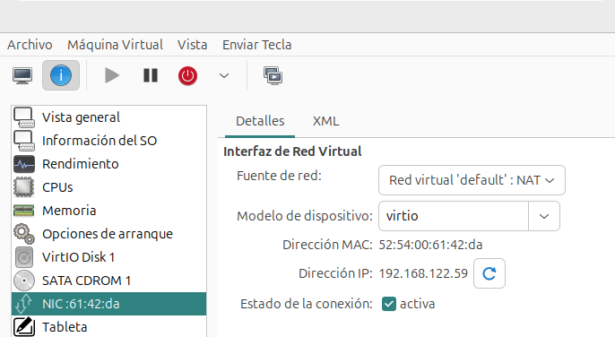

# Acceso a las máquinas virtuales desde el exterior

Una vez que hemos creado las máquinas en **virt-manager** podemos acceder a ellas utilizando la consola, pero es posible acceder a ellas utilizando otros protocolos específicos de acceso remoto, que suelen ser más eficientes para el trabajo con las máquinas.

## Acceso por SSH a las máquinas Linux

El protocolo más habitual para trabajar con máquinas Linux es SSH. Podemos instalar el servidor SSH durante la instalación del sistema operativo. Si no lo hemos hecho, podríamos instalarlo en distribuciones Debian/Ubuntu ejecutando:

    usuario@debian:~$ sudo apt install ssh

Una vez que sabemos la dirección IP de la máquina:

Desde nuestro equipo podemos acceder a esta máquina por SSH indicando el nombre de usuario y la dirección IP de la máquina virtual:

## Acceso por RDP a una máquina Windows

Normalmente, para acceder a las máquinas Windows usamos el protocolo RDP (Remote Desktop Protocol). Para acceder necesitamos usar un cliente RDP. Por ejemplo, en sistemas Linux puedes usar [Remmina](https://remmina.org/), si lo haces desde un sistema Windows puedes usar "Conexión a Escritorio remoto".

En este ejemplo voy a usar el cliente Remmina.

Hay que indicar que las versiones más sencillas como *Windows 10 Home* no tienen la posibilidad del acceso remoto, por lo tanto, vamos a utilizar una versión *Windows 10 Pro*. Lo primero que tenemos que hacer es configurar Windows para permitir el acceso remoto. Para ello elegimos **Inicio > Configuración  > Sistema > Escritorio remoto** y activa **Habilitar escritorio remoto**.

A continuación, configuramos el cliente remmina con una nueva conexión, indicando la dirección IP de la máquina, el usuario y la contraseña y la resolución de pantalla:

Y ya podemos conectar para acceder a la máquina:

