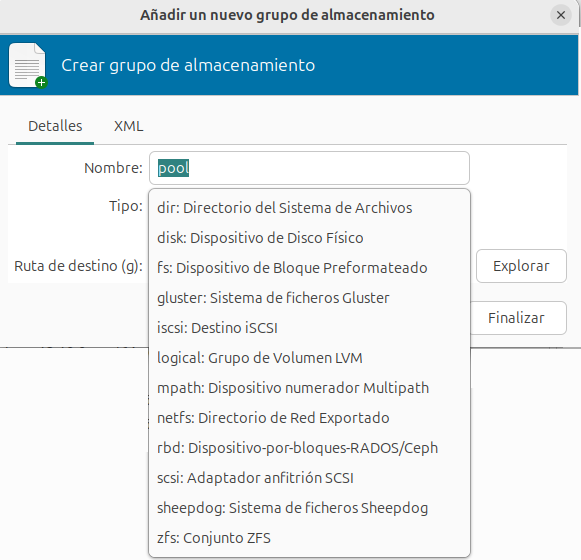

# Introducción al almacenamiento en virt-manager

El almacenamiento es un aspecto fundamental en la virtualización, ya que permite gestionar el espacio en disco de las máquinas virtuales. En **virt-manager**, el almacenamiento se organiza en **grupos de almacenamiento (storage pools)** y **volúmenes de almacenamiento (storage volumes)**. 

## Grupos de almacenamiento (Storage Pools)
Los grupos de almacenamiento en **virt-manager** son espacios lógicos donde se almacenan las imágenes de disco de las máquinas virtuales. 

Como podemos ver, existen diferentes tipos de almacenamiento compatibles con **virt-manager**, que se pueden clasificar en dos categorías principales:

* **Almacenamiento basado en dispositivos de bloques**: Estos métodos proporcionan acceso directo a dispositivos de almacenamiento de bloques, como discos físicos o volúmenes lógicos. Algunos ejemplos son:

    * **disk**: Particiones o discos físicos completos.
    * **iscsi**: Dispositivos de almacenamiento compartido a través de iSCSI.
    * **logical**: Volúmenes lógicos de LVM.
    * **zfs**: Sistemas de almacenamiento avanzados que pueden gestionar volúmenes en bruto y proporcionar snapshots.

* **Almacenamiento basado en sistemas de ficheros**: Estos métodos almacenan las imágenes de disco como archivos dentro de un sistema de ficheros. Algunos ejemplos son:

    * **dir**: Directorios locales donde se almacenan ficheros de imagen de disco (el que usaremos en este curso).
    * **nfs**: Sistema de fichero compartido en red desde un servidor NFS.
    * **glusterfs**: Sistema distribuido de almacenamiento en red.

## Volúmenes de almacenamiento (Storage Volumes)

Los volúmenes son las unidades individuales de almacenamiento dentro de un grupo. Según el tipo del grupo de almacenamiento con el que estemos trabajando, el volumen corresponderá a elementos diferentes:
* En el caso del tipo **dir**, estos volúmenes corresponden a ficheros de imagen de disco. 
* El el caso del tipo **disk** estos volúmenes serán particiones de un disco.
* En el caso del tipo **logical** estos volúmenes serán volúmenes lógicos LVM.

En este curso vamos a trabajar con grupos de almacenamiento de tipo **dir**, por lo que los volúmenes corresponderán a ficheros de imágenes de disco. Los formatos de imagen de disco más utilizados son:

* **raw**: Imagen de disco sin procesar, ofrece mejor rendimiento, pero ocupa todo el espacio asignado desde el inicio.
* **qcow2**: Formato QEMU copy-on-write. Al crearse solo se ocupa el espacio que se está ocupando con los datos (aprovisionamiento ligero), el fichero irá creciendo cuando escribamos en él. Acepta instantáneas o snapshots. Es menos eficiente en cuanto al acceso.

## Snapshots
Los snapshots (o instantáneas) permiten capturar el estado de una máquina virtual en un momento determinado. Esto resulta útil para:

* **Recuperación ante fallos**: Volver a un estado anterior en caso de errores.
* **Pruebas y desarrollo**: Permitir experimentación sin afectar los datos originales.

Los snapshots pueden ser a nivel de almacenamiento (ej. LVM, ZFS) o a nivel de imagen de disco (qcow2).

## Aprovisionamiento ligero (Thin Provisioning)
El aprovisionamiento ligero permite asignar espacio de almacenamiento de manera dinámica según sea necesario, en lugar de reservarlo completamente desde el principio. Esto optimiza el uso del espacio en disco. El formato **qcow2** soporta aprovisionamiento ligero, mientras que **raw** no lo hace.

