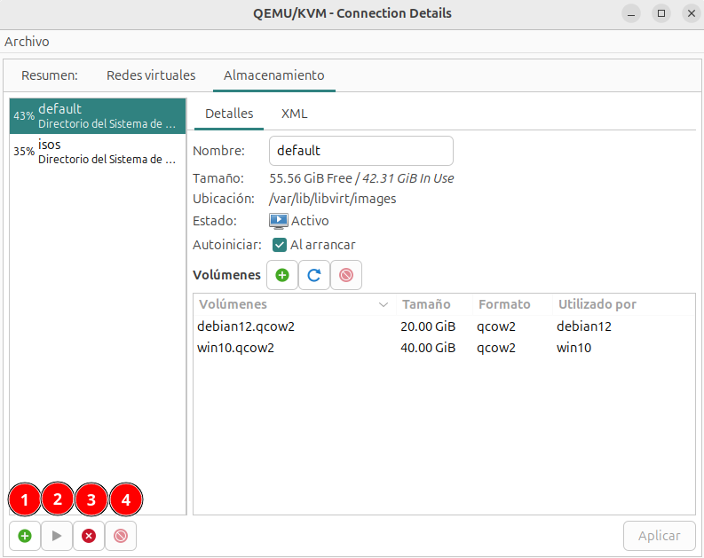
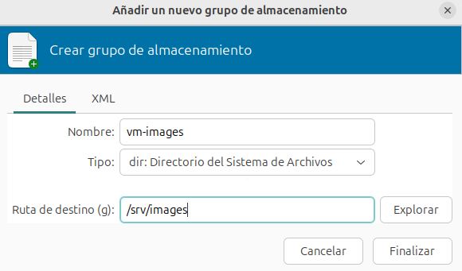
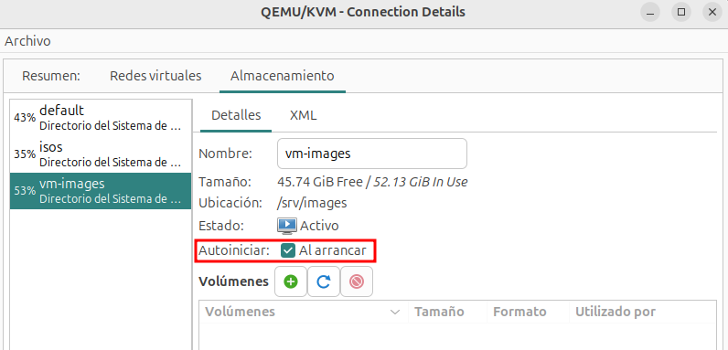
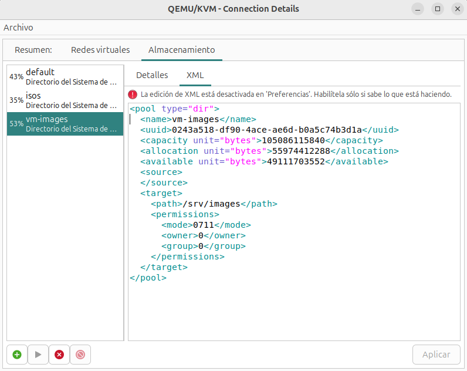

# Gestión de grupos de almacenamiento

Desde la pestaña **Almacenamiento** de los **Detalles de la conexión** podemos ver los grupos de almacenamiento que tenemos creados y podemos gestionar:

Tenemos las siguientes opciones:

* **Botón 1**: Añadir un nuevo grupo de almacenamiento.
* **Botón 2**: Iniciar el grupo seleccionado.
* **Botón 3**: Parar el grupo seleccionado.
* **Botón 4**: Eliminar el grupo seleccionado.

Si creamos un nuevo grupo, vemos la siguiente pantalla donde indicamos el nombre, el tipo y en el caso del tipo **dir**, el directorio:

Una vez creado, observamos que está iniciado y que tiene marcada como activa la propiedad de autoiniciar:

Por último, recordar que desde **virt-manager** podemos ver la definición XML de los recursos con los que trabajamos:

