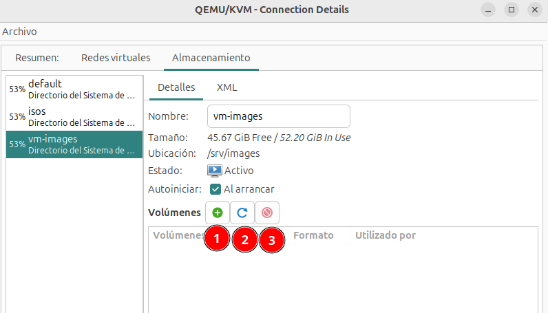

# Gestión de volúmenes de almacenamiento

Desde la pestaña **Almacenamiento** de los **Detalles de la conexión** podemos ver los grupos de almacenamiento y los volúmenes que tenemos creados y podemos gestionarlos:

Tenemos las siguientes opciones relacionadas con los volúmenes:

* **Botón 1**: Añadir un nuevo volumen en el grupo seleccionado.
* **Botón 2**: Refrescar el grupo seleccionado. Actualiza el contenido del grupo para incluir los volúmenes que se han creado o modificado con herramientas externas.
* **Botón 3**: Eliminar el volumen seleccionado.

Vamos a crear un nuevo volumen en el grupo que hemos creado en el apartado anterior. Si creamos un nuevo volumen, vemos la siguiente pantalla donde indicamos la siguiente información (la información solicitada dependerá del tipo de grupo con el que estemos trabajando):

* El **nombre** del volumen.
* El **formato**: qcow2 o raw.
* **Almacenamiento de copias de seguridad**: Nos proporciona la característica de crear volúmenes a partir de un volumen base o imagen base. Lo estudiaremos más adelante en el curso.
* **Capacidad**: Indicamos el tamaño del volumen. Por defecto, si usamos el formato qcow2 obtendremos la característica de aprovisionamiento ligero, el tamaño indicado será el que ve la máquina virtual, pero no lo que se ocupa realmente en el disco del host. Si elegimos la opción **Pre-asignar el tamaño completo del volumen ahora**, se perderá esa característica y se ocupara el disco la capacidad total elegida.

