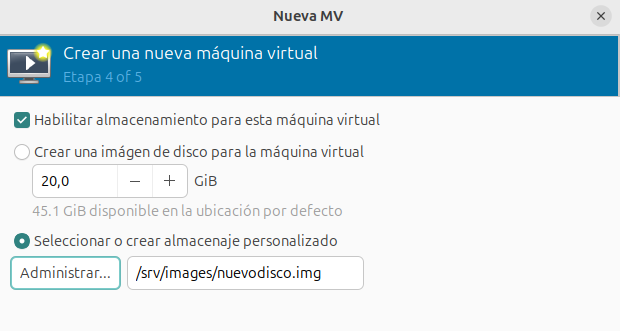

# Trabajar con volúmenes en las máquinas virtuales

## Creación de máquinas virtuales usando volúmenes existentes

En el apartado anterior creamos un volumen de 10 GB llamado `nuevodisco.img`. Vamos a crear una nueva máquina virtual que tenga como disco duro este volumen. Para ello, durante el asistente de creación de la máquina, elegimos el volumen que tenemos creado:

* En este caso el volumen utilizado estará en el nuevo grupo de almacenamiento `vm-images` que hemos creado, por defecto los discos de las máquinas se crean en el grupo `default`.
* El rendimiento de acceso a esta máquina será mayor que si usáramos una imagen con formato qcow2 ya que los discos con formato raw tienen asignados desde su creación todo el espacio necesario.

## Añadir nuevos discos a máquinas virtuales

Hemos creado dos volúmenes de 1G en el grupo de almacenamiento `vm-images` llamados `disco1.qcow2` y `disco2.qcow` y lo vamos a añadir a las dos máquinas que tenemos creadas, una con Linux y otra con Windows. Esta operación se puede realizar con la máquina virtual ejecutándose. Si **añadimos nuevo hardware** en la vista detalle de la máquina, podemos añadir nuevo almacenamiento (repetimos esta operación en las dos máquinas):

En el sistema Linux Debian, podemos utilizar la aplicación **discos** y vemos como se ha añadido el nuevo disco. Con esta herramienta podemos formatear el disco y posteriormente montarlo en nuestro sistema de archivos.

En el sistema Windows, podemos utilizar la aplicación **Administración de discos** y realizar las mismas operaciones.

Para desconectar un disco de una máquina virtual, simplemente pulsaríamos con el botón derecho sobre el dispositivo de disco en la vista detalle, y pulsaríamos sobre **Eliminar Hardware**.

