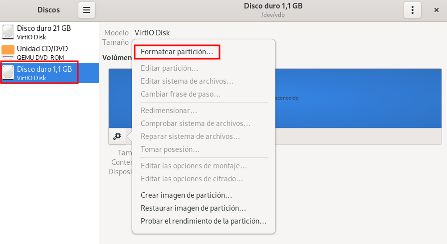

# Trabajar con volúmenes en las máquinas virtuales

## Creación de máquinas virtuales usando volúmenes existentes

En el apartado anterior creamos un volumen de 10 GB llamado `vol1.qcow2`. Vamos a crear una nueva máquina virtual que tenga como disco duro este volumen. Para ello, durante el asistente de creación de la máquina, elegimos el volumen que tenemos creado:

## Añadir nuevos discos a máquinas virtuales

Si **añadimos nuevo hardware** en la vista detalle de la máquina, podemos añadir nuevo almacenamiento:

Como hemos comentado la máquina `prueba4` está en ejecución y podemos comprobar que se ha añadido el disco:

Y podríamos formatear, montar y usar el nuevo disco:

Para desconectar un disco de una máquina virtual, simplemente pulsaríamos con el botón derecho sobre el dispositivo de disco en la vista detalle, y pulsaríamos sobre **Eliminar Hardware**.

