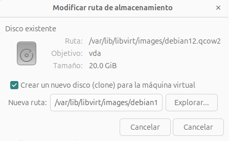
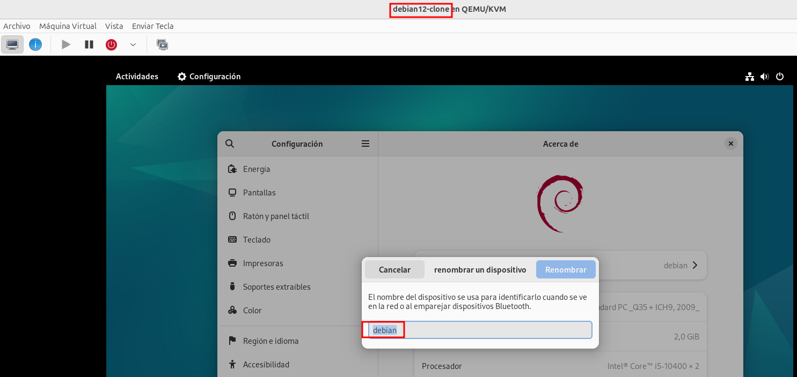

# Clonación completa de máquinas virtuales

La clonación completa de una máquina virtual copia la configuración XML de la máquina de origen y sus imágenes de disco, y realiza ajustes en las configuraciones para asegurar la unicidad de la nueva máquina. Esto incluye cambiar el nombre de la máquina y asegurarse de que utiliza los clones de las imágenes de disco. No obstante, los datos almacenados en los discos virtuales del clon son idénticos a los de la máquina de origen. 

La clonación completa nos permite crear nuevas máquinas de forma muy sencilla, sin necesidad de pasar por el proceso de instalación desde una imagen ISO.

Para realizar la clonación vamos a partir de una máquina virtual que esté apagada. Si elegimos una máquina virtual y pulsamos el botón derecho del ratón tenemos a nuestra disposición la opción **Clonar**, comenzamos el proceso de clonación donde podemos indicar el nombre de la nueva máquina virtual:

Si pulsamos sobre el botón **Detalles...** podemos cambiar el nombre del nuevo fichero de imagen donde se realiza la clonación.

Si no escogemos el disco de la máquina virtual se producirá una clonación donde no se crea una copia del disco, sino que la nueva máquina virtual utilizará el mismo archivo de disco que la máquina original. Como ventaja podemos indicar  que no se ocupa espacio adicional, ya que ambas máquinas comparten el mismo almacenamiento. Sin embargo, los cambios que se produzcan en una máquina se reflejaran en la otra, además si las dos máquinas escriben al mismo tiempo pueden generar corrupción de datos en el disco. Solo es recomendable en escenarios particulares, por ejemplo trabajando con clúster de máquinas.

## Las máquinas virtuales clonadas son iguales a las originales

La máquina clon que hemos creado es igual a la original. La nueva máquina contiene identificadores que deberían ser únicos (como el machine ID, direcciones MAC, claves SSH de host, hostname, ...).

Podemos acceder a la máquina y cambiar el nombre de la máquina modificando el fichero `/etc/hostname` o desde el apartado de configuración **Acerca de**, pero todavía tendríamos mucha información repetida entre las dos máquinas. 

