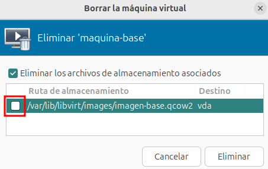
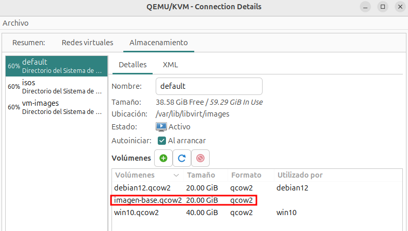
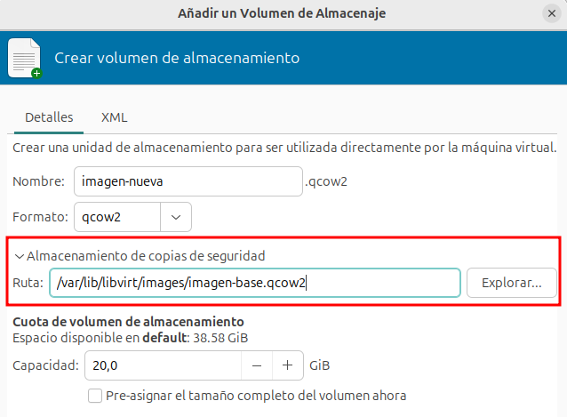
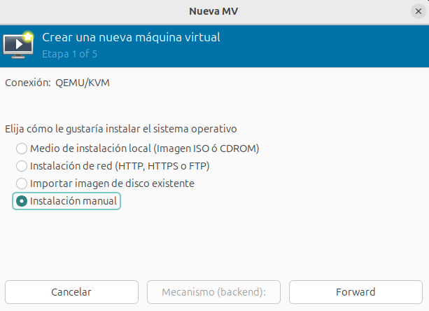
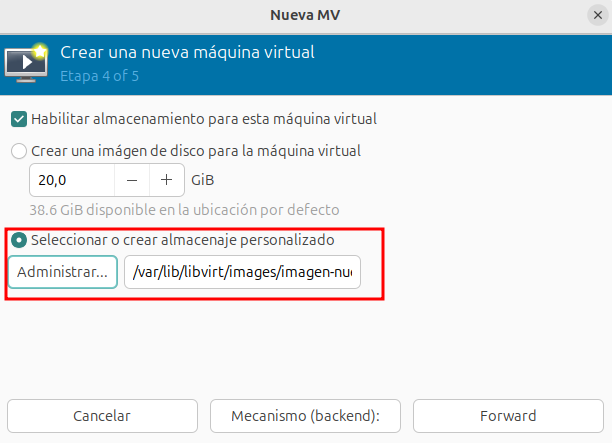
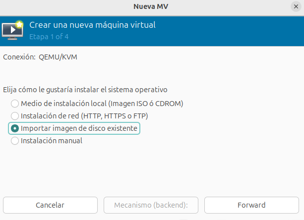
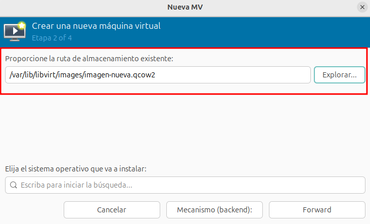

# Clonación enlazada de máquinas virtuales

Además de la clonación completa que estudiamos en el punto anterior, podemos usar la **clonación enlazada** para la creación rápida de nuevas máquinas virtuales.

La **clonación enlazada** es una técnica de creación de máquinas virtuales en la que el disco de la nueva máquina se basa en una imagen de disco existente (**backing store**), en lugar de copiarla completamente. Se utiliza un archivo diferencial que almacena solo los cambios con respecto a la imagen base, lo que permite ahorrar espacio y acelerar la creación de nuevas máquinas virtuales.  

Esta técnica es especialmente útil en entornos donde se necesitan múltiples máquinas virtuales con una configuración similar, como laboratorios de prueba o despliegues rápidos. Sin embargo, dado que las máquinas clonadas dependen de la imagen base, si esta se elimina o se corrompe, todas las máquinas enlazadas se verán afectadas.  

## Creación de la imagen base

Para crear la imagen base, creamos una nueva máquina virtual. Según nuestras necesidades instalaremos el software y realizaremos la configuración necesaria, teniendo en cuenta que las nuevas máquinas creadas tendrán la misma configuración que ella.

Una vez creada la máquina, la eliminamos **sin borrar la imagen de disco**:

Aunque no es necesario eliminar la máquina virtual, si es necesario asegurarse de que la imagen base no se va a modificar.

## Creación de imágenes de disco con backing store

A continuación vamos a crear un nuevo volumen a partir de la imagen base que hemos creado en el punto anterior. Hay que tener en cuenta lo siguiente:

* El nuevo volumen no puede más pequeño que la imagen base.
* El nuevo volumen puede tener más tamaño que la imagen base, pero al iniciar la máquina habrá que redimensionar el tamaño del sistema de ficheros, que será igual al tamaño del sistema de ficheros de la imagen base.

Para no complicar la creación de volúmenes con backing store vamos a indicar el tamaño del nuevo volumen igual al de la imagen base.

Podemos comprobar el tamaño de la imagen base, accediendo a la lista de volúmenes:

A continuación para crear un nuevo volumen a partir de la imagen base, lo creamos indicando el fichero de la imagen base en la opción **Almacenamiento de copias de seguridad**:

## Creación de la nueva máquina virtual

Por último, usando **virt-manager**, durante el asistente de creación de la máquina, elegimos la opción **Instalación manual**, ya que no vamos a usar una imagen ISO:

Y posteriormente, escogemos el volumen que tenemos creado:

Otra forma, sería escogiendo la opción **Importar imagen de disco existente** en la creación de la máquina:

Y eligiendo el volumen en el siguiente paso:

