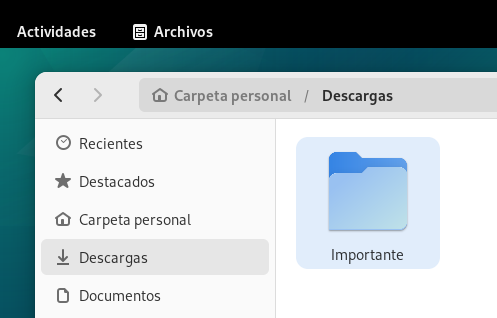
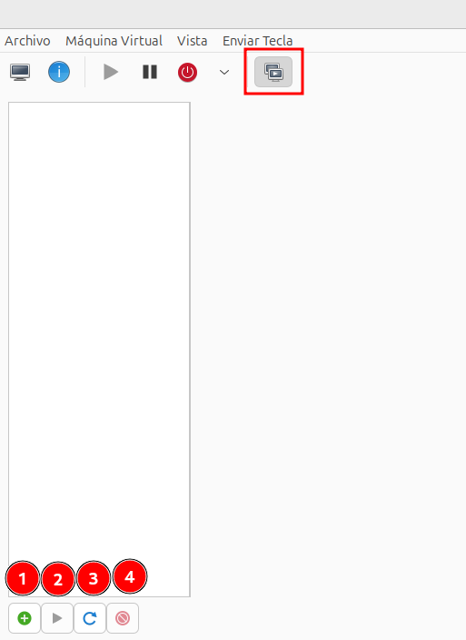
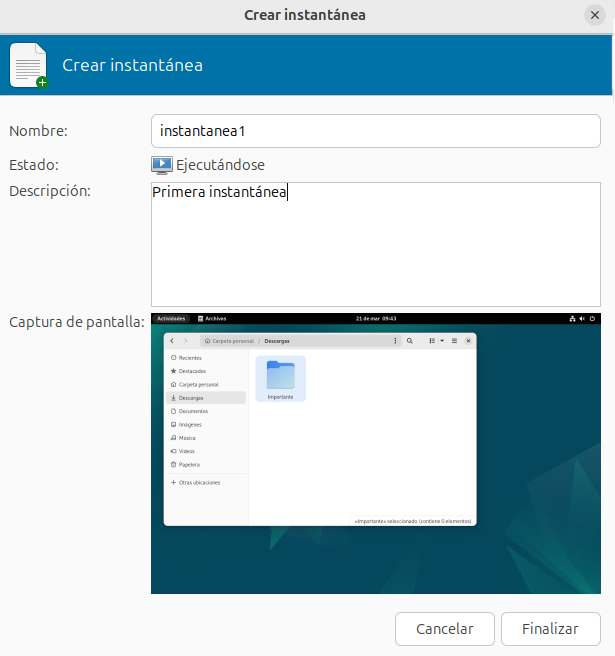
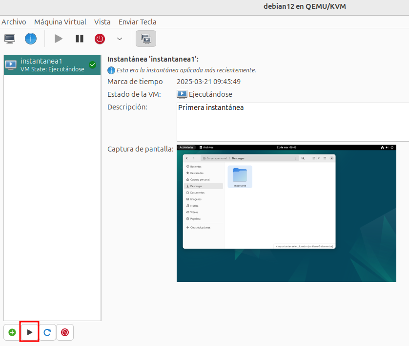

# Instantáneas de máquinas virtuales

Una instantánea (snapshot) nos ofrece la funcionalidad muy útil de guardar el estado de una máquina virtual (MV) en un momento dado, permitiendo volver a ese estado más adelante. 

Tipos de instantáneas:

* Instantáneas en caliente (live snapshots): 
    * Se realizan con la máquina virtual encendida. 
    * Se guarda el estado de la memoria RAM (estado en ejecución), del disco (estado del sistema de archivos) y el estado del dispositivo.
    * Permiten volver exactamente al mismo punto de ejecución.
    * Requieren que el almacenamiento permita esta funcionalidad, por ejemplo con ficheros de imágenes de disco requiere el formato qcow2.
    * Son más complejas y pueden causar un pequeño impacto en el rendimiento mientras se crean, ya que se pausa la máquina virtual.
* Instantáneas en frío (offline snapshots):
    * Se hacen con la máquina virtual detenida.
    * Solo se guarda el estado del disco (y la configuración XML si se indica).
    * No se guarda el contenido de la memoria RAM.    
    * Son más rápidas y seguras de hacer, porque no hay riesgo de inconsistencia.
    * También requiere que el almacenamiento acepte los snapshots.

## Ejemplo de instantánea

Hemos hecho un cambio significativo en nuestra máquina (en el ejemplo hemos creado una carpeta). 

Ahora es el momento de crear una instantánea, de esta manera podremos volver a este estado en un momento futuro. Accediendo a la **Administrar instantáneas de máquina virtual** obtenemos la ventana para gestionar las instantáneas:

Tenemos botones para las opciones más comunes:

* **Botón 1**: Crear instantánea.
* **Botón 2**: Volver al estado de la instantánea seleccionada.
* **Botón 3**: Refrescar la lista de instantáneas.
* **Botón 4**: Borrar la instantánea seleccionada.

Al crear una instantánea, podemos indicar el nombre, la descripción y se guarda una captura de pantalla de la máquina.

Si hemos tenido un problema en nuestra máquina, por ejemplo hemos eliminado nuestra carpeta importante, podemos recuperar la instantánea y volver al estado anterior.

Puede ser muy interesante tomar instantáneas periódicamente a una máquina virtual. Si tenemos cualquier problema con la máquina podemos volver a un estado estable anterior.
Esta característica puede ser muy útil, ya que nos permite experimentar con la máquina, y si tenemos algún problema, podemos volver al estado original y no tener que eliminar la máquina.

