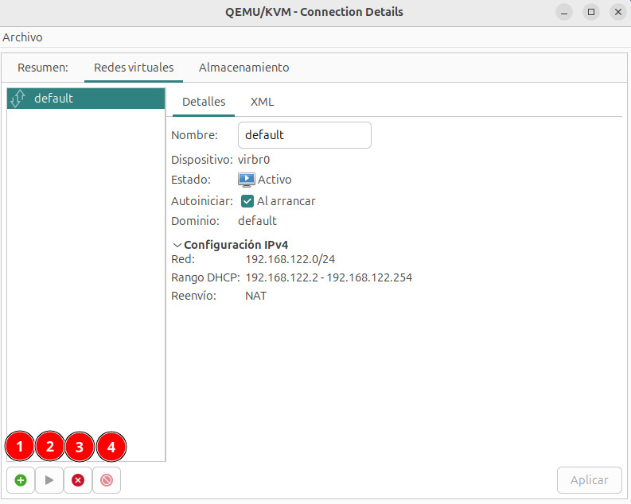

# Definición de redes virtuales de tipo NAT

Recordamos que una red de tipo NAT es un Red Virtual Privada, las máquinas virtual tendrán un direccionamiento privado y se nos proporciona un mecanismo de **router/nat** para que tengan conectividad al exterior.

Desde la pestaña **Redes virtuales** de los **Detalles** de la conexión podemos ver las redes que tenemos creadas y podemos gestionarlas:

Tenemos las siguientes opciones:

* **Botón 1**: Añadir una nueva red.
* **Botón 2**: Iniciar la red seleccionada.
* **Botón 3**: Parar la red seleccionada.
* **Botón 4**: Eliminar la red seleccionada.

## Creación de una red virtual de tipo NAT

Pulsamos sobre el botón de añadir una nueva red, indicamos el **Nombre**, en el **Modo** elegimos **NAT** e indicamos su configuración:

* **Configuración IPv4**: 
    * Elegimos la opción de **Habilitar IPv4**, indicando la dirección de **Red** con la que vamos a trabajar. La primera dirección será la dirección IP del anfitrión en esta red y la puerta de enlace de las máquinas virtuales conectadas a esta red.
    * Elegimos la opción de ***Habilitar DHCPv4**, indicando el rango de direcciones que va a repartir el servidor DHCP. normalmente las redes de tipo NAT tienen habilitado el servidor DHCP.
* **Configuración IPv6**: Si queremos trabajar con IPv6 podemos seleccionar la opción **Habilitar IPv6**, pode defecto está deshabilitada.
* **Nombre de dominio DNS**: Esta opción permiten definir cómo se asignará el dominio a las máquinas virtuales conectadas a esa red. 
    * **Usar nombre de red**: El nombre de la red virtual se usará como el dominio DNS.
    * **Personalizado**: Podemos indicar el nombre de dominio que se va a utilizar.

IMAGEN

Una vez creado, observamos que está iniciado y que tiene marcada como activa la propiedad de **Autoiniciar**. Además observamos que el nombre del bridge lo ha asignado de forma automática:

IMAGEN

Por último, recordar que desde virt-manager podemos ver la definición XML de los recursos con los que trabajamos:

IMAGEN