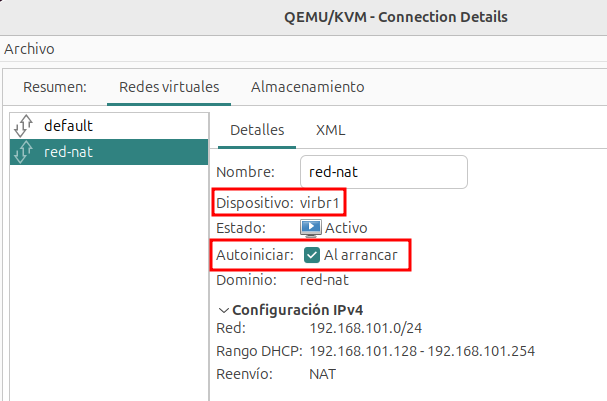
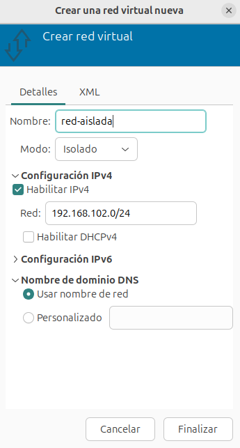
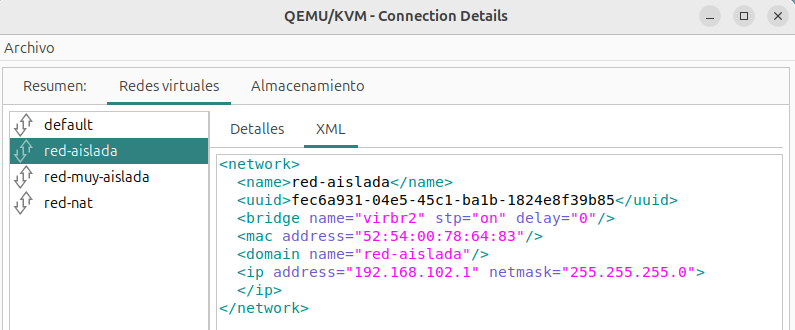

# Definición de redes

Desde la pestaña **Redes virtuales** de los **Detalles** de la conexión podemos ver las redes que tenemos creadas y podemos gestionarlas:

Tenemos las siguientes opciones:

* **Botón 1**: Añadir una nueva red.
* **Botón 2**: Iniciar la red seleccionada.
* **Botón 3**: Parar la red seleccionada.
* **Botón 4**: Eliminar la red seleccionada.

## Definición de redes virtuales de tipo NAT

Recordamos que una red de tipo NAT es un Red Virtual Privada, las máquinas virtual tendrán un direccionamiento privado y se nos proporciona un mecanismo de router/nat para que tengan conectividad al exterior.

Pulsamos sobre el botón de añadir una nueva red, indicamos el **Nombre** y en el **Modo** elegimos **NAT**. La opción **Reenviar a:** permite seleccionar la interfaz física del sistema anfitrión a través de la cual se enviará el tráfico de la red virtual. Nos ofrece dos opciones:

* **Cualquier dispositivo físico**: El tráfico saldrá por cualquier interfaz física disponible. Es la opción que dejamos por defecto.
* **Dispositivo específico...**: El tráfico se redirigirá a esa interfaz en particular (por ejemplo, `eth0`, `wlan0`,...).

A continuación terminamos la configuración:

* **Configuración IPv4**: 
    * Elegimos la opción de **Habilitar IPv4**, indicando la dirección de **Red** con la que vamos a trabajar. La primera dirección será la dirección IP del anfitrión en esta red y la puerta de enlace de las máquinas virtuales conectadas a esta red.
    * Elegimos la opción de **Habilitar DHCPv4**, indicando el rango de direcciones que va a repartir el servidor DHCP. Normalmente las redes de tipo NAT tienen habilitado el servidor DHCP.
* **Configuración IPv6**: Si queremos trabajar con IPv6 podemos seleccionar la opción **Habilitar IPv6**, por defecto está deshabilitada.
* **Nombre de dominio DNS**: Esta opción permite definir cómo se asignará el dominio a las máquinas virtuales conectadas a esa red. 
    * **Usar nombre de red**: El nombre de la red virtual se usará como el dominio DNS.
    * **Personalizado**: Podemos indicar el nombre de dominio que se va a utilizar.

Una vez creada, observamos que está iniciada y que tiene marcada como activa la propiedad de **Autoiniciar**. Además observamos que el nombre del bridge lo ha asignado de forma automática:

Por último, recordar que desde **virt-manager** podemos ver la definición XML de los recursos con los que trabajamos.

## Definición de redes virtuales aisladas

Las Redes Virtuales aisladas (Isolated) es un tipo de Red Virtual Privada, donde las máquinas virtuales tomas direccionamiento privado. No tenemos un mecanismo de router/nat, por lo que las máquinas virtuales no tienen conectividad con el exterior. 

Si el anfitrión está conectada a la red la llamamos **Red Aislada**, en caso contrario la llamamos **Red muy Aislada**.

Pulsamos sobre el botón de añadir una nueva red, indicamos el **Nombre**, en el **Modo** elegimos **Isolado** e indicamos su configuración:

* **Configuración IPv4**: 
    * Elegimos la opción de **Habilitar IPv4**, indicando la dirección de **Red** con la que vamos a trabajar. La primera dirección será la dirección IP del anfitrión en esta red y la puerta de enlace de las máquinas virtuales conectadas a esta red.
    * En este caso y según nuestras necesidades podemos habilitar o no el servidor DHCP (no vamos a habilitar el servidor DHCP para realizar un ejercicio posteriormente).
* **Configuración IPv6**: Si queremos trabajar con IPv6 podemos seleccionar la opción **Habilitar IPv6**.
* **Nombre de dominio DNS**: Esta opción permiten definir cómo se asignará el dominio a las máquinas virtuales conectadas a esa red, funciona de la misma manera que en las redes de tipo NAT.
    

De la misma manera que en las redes de tipo NAT, podemos comprobar que al crear la red estará iniciada y se habrá escogido la opción de **Auotoiniciar**. Además se habrá creado otro bridge para gestionar esta red.

También podemos ver la definición XML de la red:

## Definición de redes virtuales muy aisladas

Para crear una Red Virtual muy Aislada, seguimos el mismo procedimiento que la anterior, pero en este caso, no elegimos la opción de **Habilitar IPv4**. Por lo tanto se creará un nuevo bridge donde se conectarán las máquinas virtuales, pero el anfitrión no estará conectado a esta red.

Al terminar la creación, la red estará iniciada y se habrá configurado la opción de **Autoiniciar**. Además podremos ver el nombre del bridge que se ha creado.

Por último podremos ver la definición XML de esta red.

## Definición de redes puentes

Con **virt-manager** no podemos crear redes puentes como veíamos anteriormente con las redes privadas. Sin embargo, en la configuración de las tarjetas de red de las máquinas virtuales, podemos indicar que no se conecten a una red privada, configurado el puente externo al que estará conectada o indicando el dispositivo físico que se va a utilizar para la conexión al exterior.
