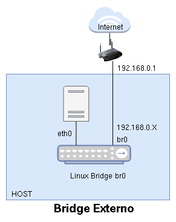
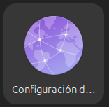
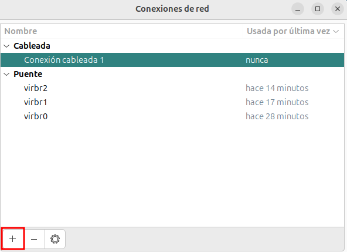
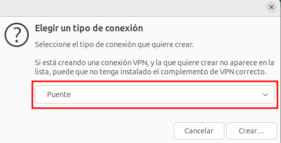
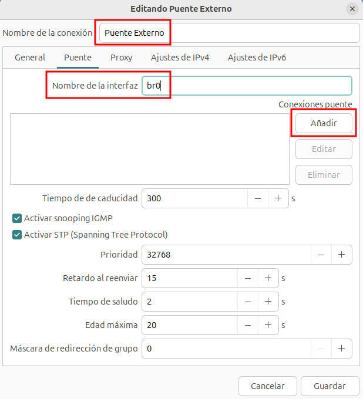
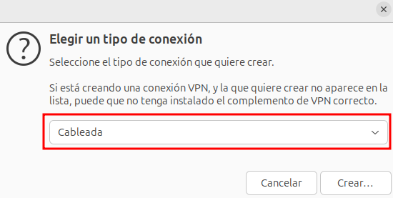
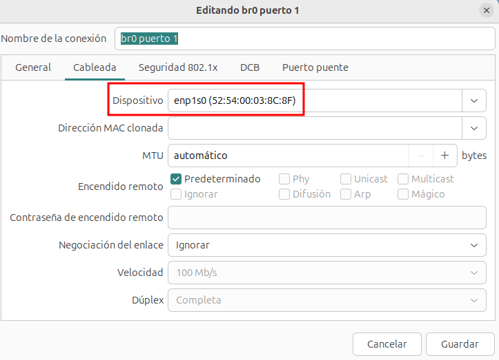
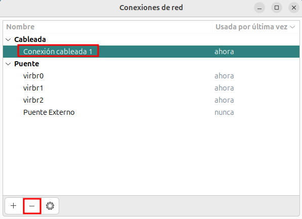
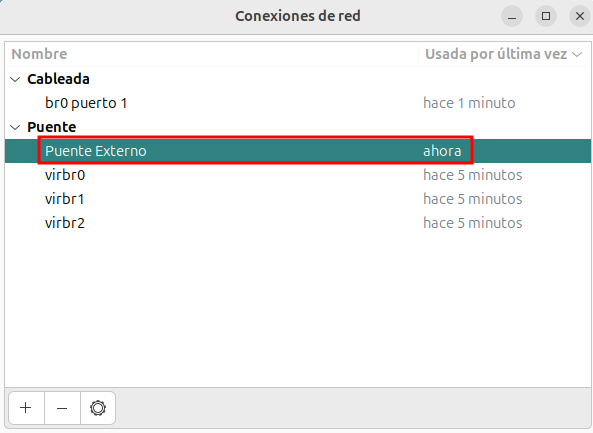

# Creación de un puente externo

Un puente externo es un bridge virtual que estará conectado al router de la red local. El bridge se creará en el servidor donde estamos virtualizando (host). El host estará conectado a este bridge para tener conectividad al exterior. Veamos un esquema:



* El bridge que vamos a crear lo vamos a llamar `br0`.
* En el host aparecerá una interfaz de red con el mismo nombre que representa la conexión al bridge. Está interfaz de red se configurará de forma estática o dinámica (si la red local tiene un servidor DHCP).
* En el ejemplo vemos que la interfaz física de red es `eth0` que estará conectada a `br0` para que el host tenga conectividad al exterior. Esa interfaz de red no tendrá asignada dirección IP.
* Posteriormente veremos como podemos conectar las máquinas virtuales a este bridge de tal manera que tomaran direcciones IP en el mismo direccionamiento que el host.

**Nota: Si conectamos al bridge una interfaz de tipo wifi podemos tener problemas de conectividad. No todas las tarjetas inalámbricas permiten la conexión a puentes virtuales.**

## Creación de un bridge externo con NetworkManager

**NetworkManager** es una utilidad gráfica para simplificar el uso de redes en sistemas Linux. Normalmente la tenemos instaladas con sistemas Linux con entornos gráficos como Gnome. Junto a esa utilidad tenemos otra que se puede ejecutar con el comando `nm-connection-editor`, y que se llama **Configuración de redes**:



Si lo ejecutamos accedemos a la siguiente pantalla:



Donde vemos la conexión de red cableada (o de wifi) que tenemos y los bridge virtuales que se han creado cuando hemos estado trabajando con las redes privadas en **virt-manager**. Pulsando el botón **+**, podemos de alta nueva conexión. Añadiremos una conexión de tipo **Puente**:



Y podemos indicar el nombre de la conexión, el nombre del puente que estamos creando, y a continuación vamos a añadirle una conexión al bridge que será la interfaz de red física del host que está actualmente conectada al exterior.



Añadimos un conexión **Cableada** que será la interfaz física del host (en mi caso `enp1s0`):





Finalmente borramos la conexión cableada que tenemos actualmente:



Y en unos segundos, se conectará de forma automática a la conexión **Puente Externo**:

 

Comprobamos la configuración de red del host, ejecutando desde el terminal:

```
$ ip a

ip a
2: enp1s0: <BROADCAST,MULTICAST,UP,LOWER_UP> mtu 1500 qdisc fq_codel master br0 state UP group default qlen 1000
    link/ether 52:54:00:03:8c:8f brd ff:ff:ff:ff:ff:ff
...
7: br0: <NO-CARRIER,BROADCAST,MULTICAST,UP> mtu 1500 qdisc noqueue state DOWN group default qlen 1000
    link/ether 4e:34:25:6e:1b:84 brd ff:ff:ff:ff:ff:ff
    inet 192.168.100.200/24 brd 192.168.100.255 scope global dynamic noprefixroute br0
...
```

Comprobamos que la interfaz física `enp1s0` no tiene dirección IP, ya que está conectada al bridge. La interfaz de red `br0` representa la conexión del bridge que ha tomado una dirección IP del servidor DHCP de la red local (esta dirección IP será diferente a la que tenía anteriormente la interfaz física).