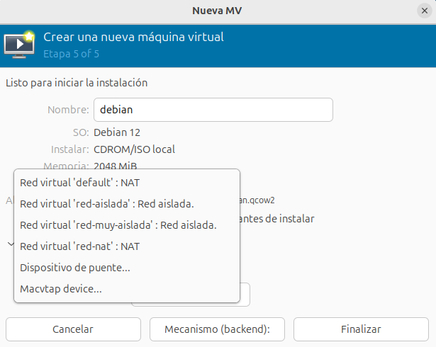
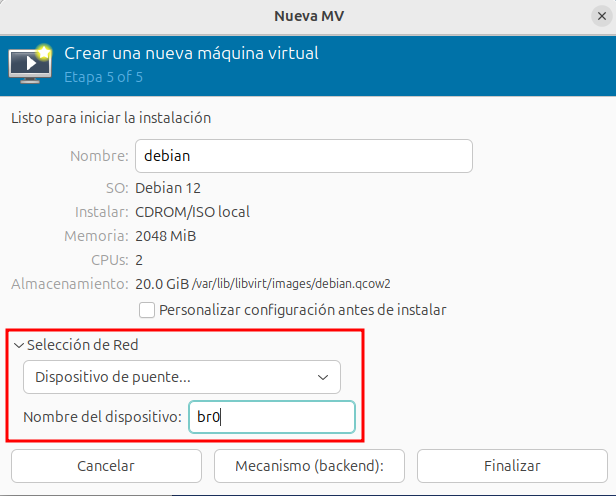
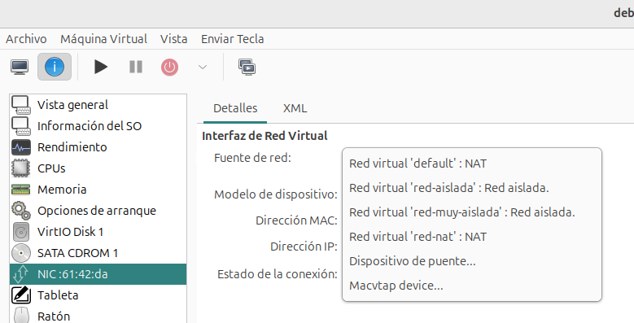

# Configuración de red en las máquinas virtuales

Todas las máquinas que hemos creado durante el curso se han conectado de forma predeterminada a la red `default`. 

Sin embargo, en este apartado vamos a aprender algunas cosas nuevas: a crear máquinas virtuales conectadas a otras redes definidas por el usuario y a añadir interfaces de red a máquinas virtuales ya existentes.

## Crear máquinas virtuales conectada a una red existente

Desde virt-manager, durante el asistente de creación de la máquina, el el último paso, podemos escoger la red a la que nos vamos a conectar:



También podemos escoger el puente virtual al que nos queremos conectar:



## Añadir nuevas interfaces de red a máquinas virtuales

Desde virt-manager elegimos la opción **Añadir nuevo hardware** en la vista detalle de la máquina y podemos añadir una nueva conexión indicando la red:



O indicando el puente virtual donde nos vamos a conectar:


También podemos modificar en cualquier momento a la red o al puente al que estamos conectado, modificando la interfaz de red desde la vista detalles:


Para eliminar la interfaz de red desde `virt-manager` simplemente pulsaríamos con el botón derecho sobre el dispositivo de red en la vista detalle, y pulsaríamos sobre **Eliminar Hardware**.

## Consideraciones finales

* Si conectamos una máquina virtual a una **Red de tipo Aislada**, tendremos que configurar de forma estática la interfaz y poner el mismo direccionamiento que hemos configurado para el host. Por ejemplo, para la red `red_aislada` usamos el direccionamiento `192.168.123.0/224` y la dirección que le asignamos al host fue `192.168.123.1`. Otras máquinas conectadas a esta red tendrán que estar configurada con el mismo direccionamiento.
* Si conectamos una máquina virtual a una **Red de tipo Muy Aislada**, tendremos que configurar de forma estática la interfaz y poner el direccionamiento que nos interese. Normalmente todas las máquinas conectada a esta red tendrán el mismo direccionamiento para que tengan conectividad entre ellas.
* Si conectamos a una **Red de tipo Bridge conectada a un bridge externo**, la máquina virtual se configurará con el mismo direccionamiento que el host. En mis caso, trabajo con la red local `172.22.0.0/16`, si conecto la máquina `prueba2` (tiene instalada un Ubuntu con NetworkManager) al bridge externo `br0`, tomará la siguiente configuración:

	```
	virsh -c qemu:///system attach-interface prueba2 bridge br0 --model virtio --persistent
	La interfaz ha sido asociada exitosamente
	```

	Iniciamos la máquina y comprobamos como la interfaz que acabamos de añadir se configura con el direccionamiento de la red local. Esta en la misma red que el host:

	

