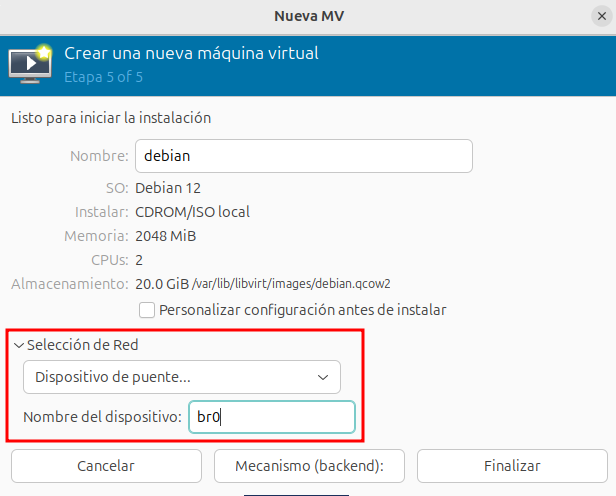

# Configuración de red en las máquinas virtuales

Todas las máquinas que hemos creado durante el curso se han conectado de forma predeterminada a la red `default`. 

Sin embargo, en este apartado vamos a aprender a crear máquinas virtuales conectadas a otras redes definidas por el usuario y a añadir interfaces de red a máquinas virtuales ya existentes.

## Crear máquinas virtuales conectada a una red existente

Desde virt-manager, durante el asistente de creación de la máquina, el el último paso que llamamos **Resumen y selección de red**, podemos escoger la red a la que nos vamos a conectar:

También podemos escoger el puente virtual al que nos queremos conectar. En el apartado **Selección de Red** elegimos la opción **Dispositivo de puente...** y en la casilla **Nombre del dispositivo** indicamos el nombre del puente externo, en nuestro caso **br0**.

La última opción sería conectar la máquina al exterior compartiendo la interfaz física del host. Para ello, en el apartado **Selección de Red** elegimos la opción **Macvtap device...** y en la casilla **Nombre del dispositivo** indicamos el nombre de la tarjeta de red física del anfitrión que vamos a usar para conectar la máquina virtual al exterior.

IMAGEN

## Añadir nuevas interfaces de red a máquinas virtuales

Desde virt-manager elegimos la opción **Añadir nuevo hardware** en la vista detalle de la máquina y podemos añadir una nueva conexión indicando la red:

O indicando el puente virtual donde nos vamos a conectar:

O indicando la interfaz de red del host que vamos a utilizar para conectar la máquina virtual al exterior:

IMAGEN

También podemos modificar en cualquier momento a la red o al puente al que estamos conectado, modificando la interfaz de red desde la vista detalles:

Para eliminar la interfaz de red desde `virt-manager` simplemente pulsaríamos con el botón derecho sobre el dispositivo de red en la vista detalle, y pulsaríamos sobre **Eliminar Hardware**.

