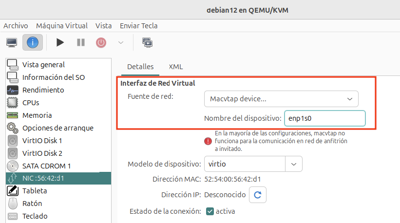
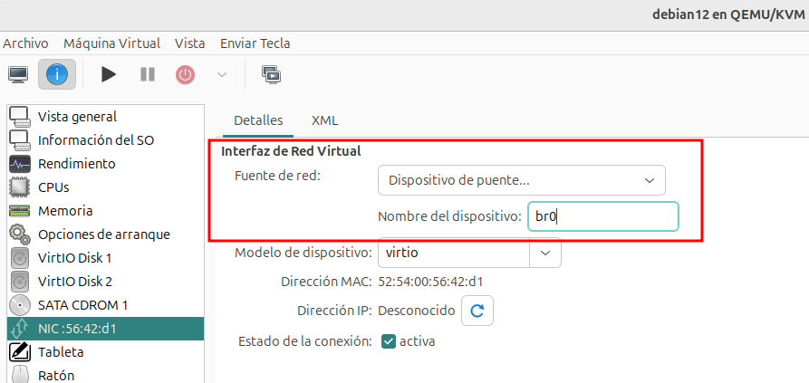

# Ejemplo 1: Trabajando con redes puentes públicas

## Redes puente compartiendo la interfaz física del host

En este primer ejemplo, vamos a parir del siguiente escenario:

* No tenemos creado un puente externo `br0` como hemos visto anteriormente. Por lo tanto la interfaz del host, que en este caso se llama `enp1s0` está conectada directamente a la red local del host. Para poder compartir una interfaz física usando un dispositivo macvtap no debe estar conectado aun puente externo.
* El host está conectado a un red con direccionamiento `192.168.100.0/24`, la puerta de enlace y el servidor DNS es la dirección `192.168.100.1`. Existe un servidor DHCP que configura de manera dinámica los equipos conectados a esta red.

Lo primero que vamos a hacer es modificar la configuración de nuestra máquina Linux y vamos a usar una conexión **Macvtap** y vamos a indicar la interfaz de red físca del host que vamos a utilizar para que la máquina virtual se conecte a la red local:

Arrancamos la máquina, nos vamos a la configuración de red y podemos comprobar el direccionamiento que ha tomado la máquina virtual, que estará conectada a la misma red del host. Existe una una limitación en la implementación de macvtap: estas conexiones no permiten la comunicación directa entre el host y la máquina virtual.

## Redes puente conectadas a un bridge externo

En este caso partimos de que hemos configurado el puente externo `br0`, donde está conectado el host y vamos a conectar nuestra máquina virtual. Volvemos a modifcar la configuración de la interfaz de red de la máquina virtual, para conectarla al puente `br0`:

Volvemos a iniciar la máquina, y comprobamos que al tener la misma dirección MAC ha tomado la misma dirección IP pero con el mismo direccionamiento:

Desde el host o desde cualquier otra máquina conectada a esta red, se podrá hacer una conexión a la máquina virtual sin ningún problema.
