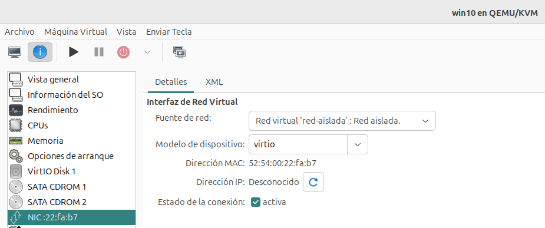

# Ejemplo 1: Trabajando con redes virtuales privadas

En este apartado vamos a configurar las dos máquinas que hemos creados con distintas configuraciones de red utilizando las redes virtuales que hemos creado.

## Trabajando con la red de tipo NAT

En primer lugar vamos a cambiar la configuración de la máquina Linux para conectarla a la red de tipo NAT llamad `red-nat` que hemos creado anteriormente (recordamos que el direccionamiento que pusimos para esta red es `192.168.101.0/24`). Para ello, modificamos la configuración del dispositivo de red de la máquina (recuerda que este cambio no se puede hacer con la máquina funcionando, si lo hacemos tendrá efecto tras un reinicio):

Accedemos a la máquina virtual y comprobamos el direccionamiento que ha tomado:

También podemos comprobar que tenemos acceso a internet sin ningún problema.

## Trabajando con la red aislada

A continuación vamos a conectar las dos máquinas a la red aislada llamada `red-aislada`, recordamos que habíamos deshabilitado el servidor DHCP y que en este caso comprobaremos que el host no hace la función de router con el mecanismo de NAT. Para ello vamos a realizar las siguientes configuraciones:

* Vamos a modificar la configuración de la máquina Linux para conectarla a la red aislada, y posteriormente configuramos la interfaz de red de forma manual con el direccionamiento que habíamos configurado en la red `red-aislada` que era `192.168.102.0/24`, tenemos que recordar que en esta red está conectada el host con la dirección `192.168.102.1`.

    

    

* Realizamos la misma operación en la máquina Windows:

    
    
    

### Comprobación de funcionamiento

A continuación, arrancamos las máquinas y vamos a realizar algunas comprobaciones:

* 