# Ejemplo 2: Trabajando con redes virtuales privadas

En este apartado vamos a configurar las dos máquinas con la que estamos trabajando con distintas configuraciones de red utilizando las redes virtuales que hemos creado.

## Trabajando con la red de tipo NAT

En primer lugar, vamos a cambiar la configuración de la máquina Linux para conectarla a la red de tipo NAT llamada `red-nat` que hemos creado anteriormente (recordamos que el direccionamiento que pusimos para esta red es `192.168.101.0/24`). Para ello, modificamos la configuración del dispositivo de red de la máquina (recuerda que este cambio no se puede hacer con la máquina funcionando, si lo hacemos tendrá efecto tras un reinicio):

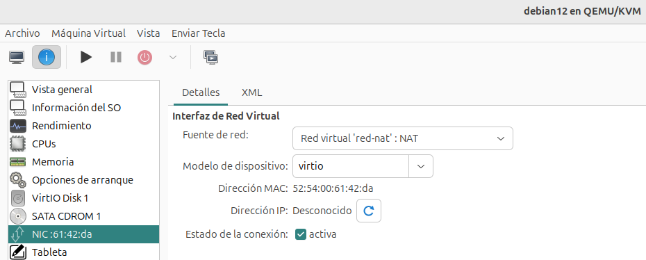

Accedemos a la máquina virtual y comprobamos el direccionamiento que ha tomado:

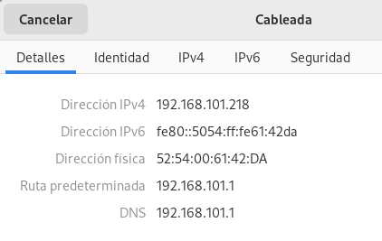

También podemos comprobar que tenemos acceso a internet sin ningún problema.

## Trabajando con la red aislada

A continuación, vamos a conectar las dos máquinas a la red aislada llamada `red-aislada`, recordamos que habíamos deshabilitado el servidor DHCP y que en este caso comprobaremos que el host no hace la función de router con el mecanismo de NAT. Para ello vamos a realizar las siguientes configuraciones:

* Vamos a modificar la configuración de la máquina Linux para conectarla a la red aislada, y posteriormente configuramos la interfaz de red de forma estática con el direccionamiento que habíamos configurado en la red `red-aislada` que era `192.168.102.0/24`, tenemos que recordar que en esta red está conectada el host con la dirección `192.168.102.1`.

    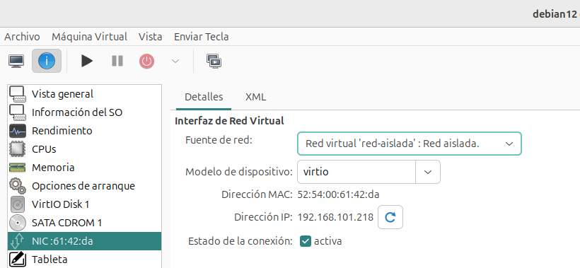

    

* Realizamos la misma operación en la máquina Windows. Además, deshabilitamos el cortafuegos para que nos permita hacer las posteriores comprobaciones:

    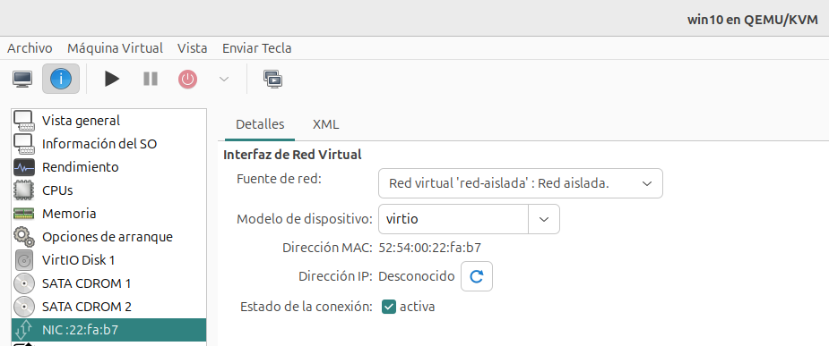
    
    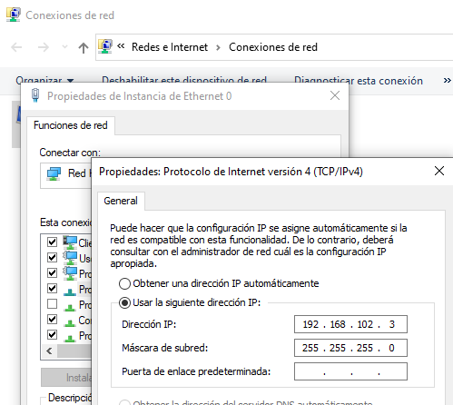

    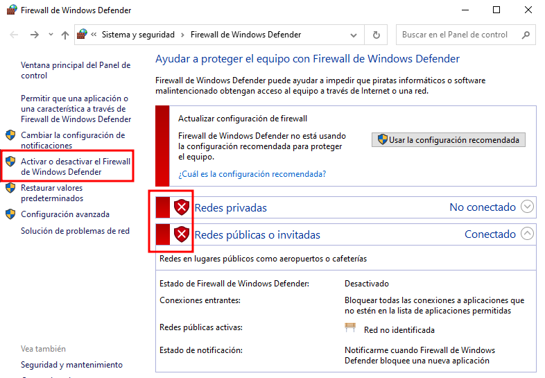

A continuación, arrancamos las máquinas y vamos a realizar algunas comprobaciones:

* Desde la máquina Linux tenemos conectividad con la máquina Windows y con el host, pero no tenemos conectividad con el exterior:

    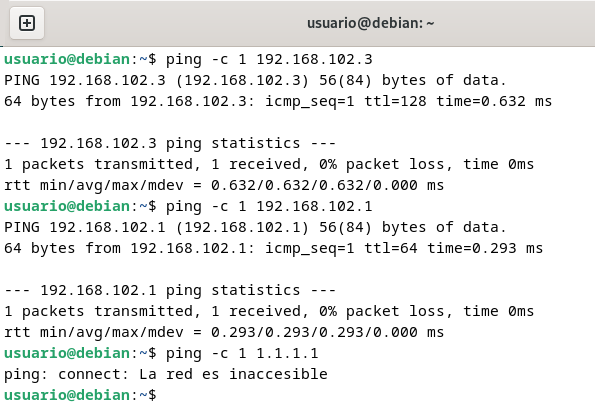

* Del mismo modo, desde la máquina Windows tenemos conectividad con la máquina Linux y el host, pero tampoco con el exterior:

    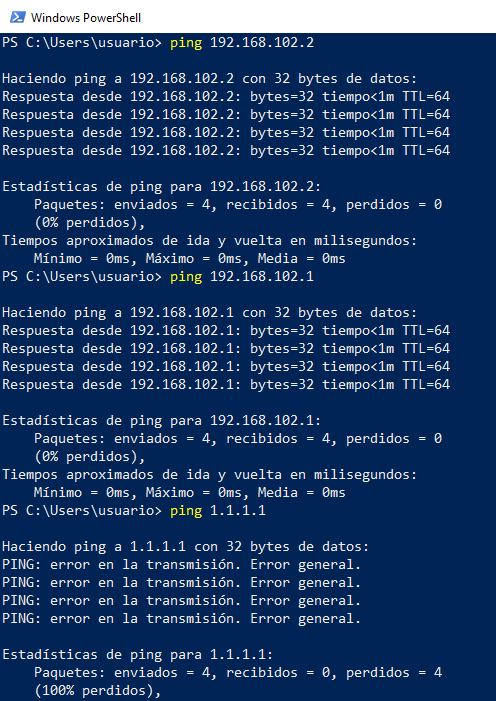

## Trabajando con la red muy aislada

En este último ejemplo modificamos la configuración de las interfaces de red de las máquinas para conectarlas con la red muy aislada llamada `red-muy-aislada`. En este caso, el host no está conectado a esta red y podemos utilizar el direccionamiento que queramos, teniendo en cuenta que las dos máquinas tienen que tener el mismo para que tengan conectividad. En este ejemplo vamos a usar el direccionamiento `172.22.0.0/16`.

*  Modificamos la configuración de la máquina Linux para conectarla a la red muy aislada, y configuramos la interfaz de red de forma estática con el direccionamiento que hemos indicado:

    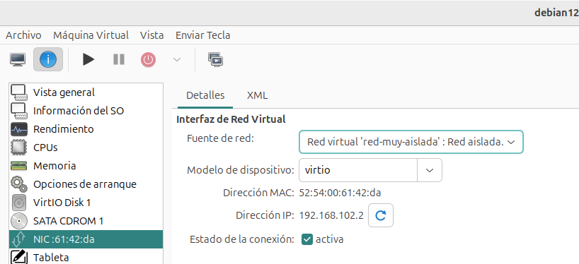

    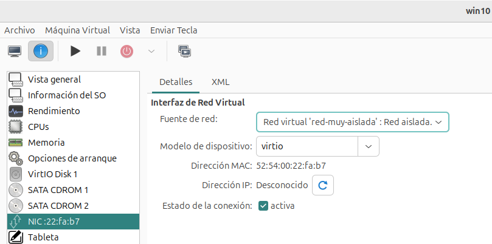

* En la máquina Windows hacemos la misma operación:

    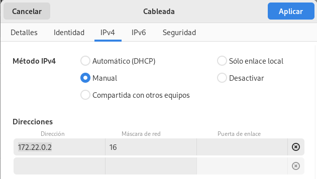

    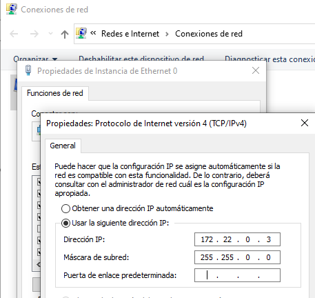

* Y finalmente comprobamos que tenemos conectividad entre las máquinas, pero no tenemos conectividad con el exterior.

    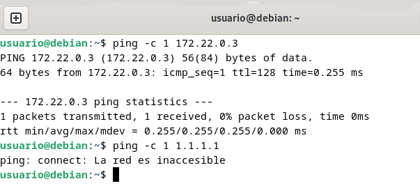
    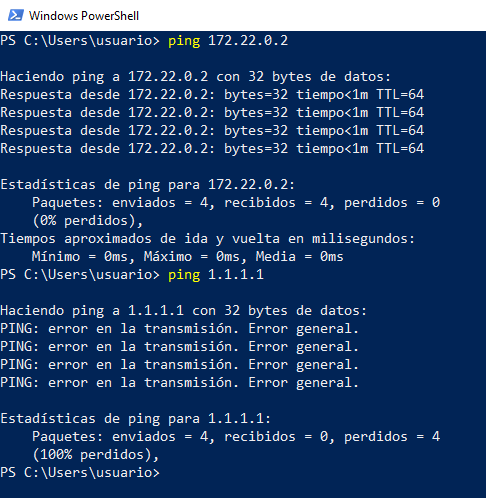

