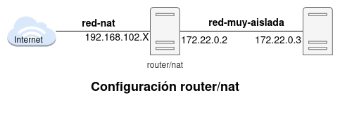

# Ejemplo 3: Configuración de un router/NAT

Partiendo del último ejemplo del apartado anterior, que remos configurar la máquina Linux para que que funcione como router y realice NAT para que la máquina Windows que está conectada a una red interna tenga conectividad con el exterior.



Para ello tenemos que hacer los siguientes pasos:

1. Añadimos a la máquina Linux una nueva interfaz de red que le permita el acceso al exterior en nuestro caso, la vamos a conectar a la red `red-nat`:

    

    Y comprobamos el direccionamiento de la máquina Linux:

    

    Está máquina accede al exterior por la interfaz conectada a `red-nat`, en el ejemplo `enp7s0`.

2. Completamos la configuración de la máquina Windows. Configuramos su puerta de enlace que será la máquina Linux, es decir la dirección `172.22.0.2` e indicamos un servidor DNS.

    

3. Configuramos en la máquina Linux el **IP forwarding** que permite reenvíe paquetes entre interfaces de red. Para hacerlo permanente, editamos el archivo `/etc/sysctl.conf` y descomentamos la línea:

```
#net.ipv4.ip_forward=1
```

A continuación ejecutamos la siguiente instrucción para  aplica los cambios:

```
sudo systecl -p
```

4. Configuramos iptables para realizar NAT. Además queremos que las reglas de cortafuegos que configuremos sean permanentes. Para  ello, lo primero instalamos los paquetes necesario:

```
$ sudo apt install iptables iptables-persistent
```

A continuación creamos la regla de NAT con iptables:

```
sudo iptables -t nat -A POSTROUTING -o enp7s0 -s 172.22.0.0/16 -j MASQUERADE
```

Esta regla realiza las siguientes acciones:

* Todos los paquetes que vengan de la red muy aislada (`-s 172.22.0.0/16`).
* Y salgan al exterior (`-o enp7s0`) (recuerda que debes cambiar la interfaz si en tu caso se llama de manera distinta).
* Se enmascara, es decir se cambia la dirección de origen por la del router (la máquina Linux) para que pueda salir afuera.

Para que la regla sea permanente después de un reinicio la guardamos con la siguiente instrucción:

```
iptables-save > /etc/iptables/rules.v4
```

5. finalmente podemos comprobar que la máquina Windows ya tiene conectividad con el exterior y puede resolver nombres por el DNS:

    