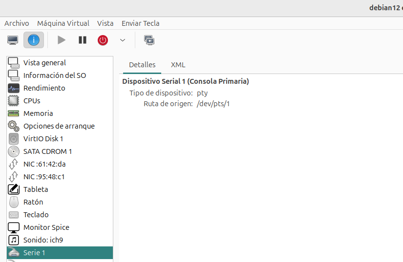
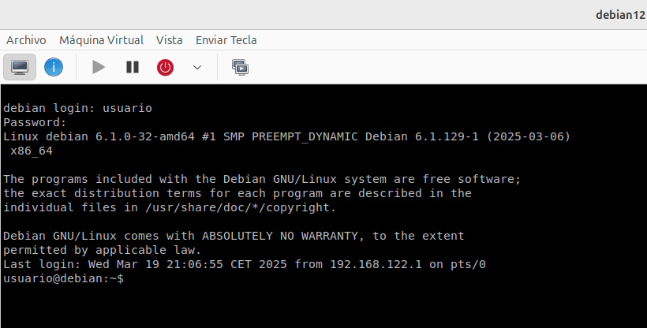

# Acceso a la máquina virtual usando la consola serie

Hasta ahora, hemos accedido a las máquinas virtuales desde la consola gráfica usando **SPICE** o **VNC**, que proporcionan una experiencia similar a tener un monitor conectado a la máquina virtual. Sin embargo, en algunos escenarios, puede ser más conveniente o incluso necesario acceder a la máquina virtual mediante **una consola serie**.  Este modo de acceso es en modo texto, no necesita entorno gráfico, ideal para administración remota y sistemas sin interfaz de usuario.

## ¿Para qué es necesario el acceso serie a una máquina KVM?

El acceso a través de **una consola serie** es útil en los siguientes casos:  

* **Servidores sin interfaz gráfica**: En entornos donde no hay un escritorio disponible (como servidores), el acceso por SPICE o VNC no es viable, pero una consola serie permite administrar el sistema de forma eficiente.  
* **Recuperación de sistemas**: Si la máquina virtual no arranca correctamente o hay problemas con los controladores gráficos, la consola serie permite acceder al sistema sin depender de una interfaz gráfica.  
* **Administración remota y automatización**: Algunas herramientas de gestión remota pueden acceder más fácilmente a la consola serie que a una interfaz gráfica, lo que facilita la automatización de tareas.  
* **Menor consumo de recursos**: Una consola serie consume **mucho menos** CPU y memoria que SPICE o VNC, lo que la hace ideal para máquinas virtuales con pocos recursos.  

## Dispositivo de hardware 

Para poder acceder a una máquina virtual mediante consola serie, la máquina debe tener configurado un **puerto serie virtual**, que en KVM se representa como **virtio-serial** o un dispositivo `ttyS0`. 



## Configuración del sistema operativo

Dentro de la máquina virtual (Linux), se debe iniciar el servicio que permite la conexión a la consola serie:  

```
$ sudo systemctl enable --now getty@ttyS0
```

* **`getty`** (abreviatura de "get TTY") es el proceso encargado de gestionar una terminal de login en Linux.  
* **`ttyS0`** es el primer puerto serie en un sistema Linux.  

Por lo tanto, estamos lanzando un **proceso de login en la consola serie**, lo que permite conectarte a la máquina a través de un puerto serie o una consola virtual en KVM/QEMU. Desde **virt-manager** elegimos la opción: **Vista - Consolas - Serie 1**.



Para salir de la consola serie tenemos que pulsar las teclas: `CTRL + ALT GR + ]`.