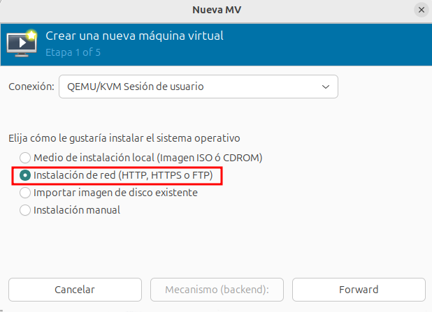

# Creación de máquinas virtuales por red

virt-manager permite instalar sistemas operativos en máquinas virtuales utilizando imágenes de instalación alojadas en servidores accesibles por red mediante HTTP, FTP o NFS. Este método es útil cuando no se quiere descargar manualmente una ISO o cuando se tiene un repositorio centralizado de imágenes.

Muchas distribuciones Linux nos ofrecen repositorios de instalación que son accesible desde distintas URL:

* **Debian**: http://deb.debian.org/debian/dists/bookworm/main/installer-amd64/
* **CentOS**: http://mirror.centos.org/centos/9-stream/BaseOS/x86_64/os/
* **Rocky Linux**: http://download.rockylinux.org/pub/rocky/9/BaseOS/x86_64/os/
* **AlmaLinux**: http://repo.almalinux.org/almalinux/9/BaseOS/x86_64/os/
* **Fedora**: https://download.fedoraproject.org/pub/fedora/linux/releases/41/Everything/x86_64/os/
* **Arch Linux**: http://mirror.rackspace.com/archlinux/iso/latest/

Para que una URL sea válida como fuente de instalación en red, debe contener una estructura específica con los archivos esenciales para el arranque y la instalación: el kernel del instalación, la imagen del disco RAM inicial que contiene el sistema mínimo necesario para comenzar la instalación,...

## Instalación en red con virt-manager

Iniciamos la creación de una nueva máquina virtual y escogemos el método de instalación:

A continuación, indicamos la URL correspondiente al repositorio de instalación y elegimos la variante del sistema operativo que vamos a instalar:

Terminamos de configuración la máquina virtual que estamos creando y al arrancarse podremos realizar la instalación del sistema operativo sin necesidad de habernos descargado la imagen ISO.