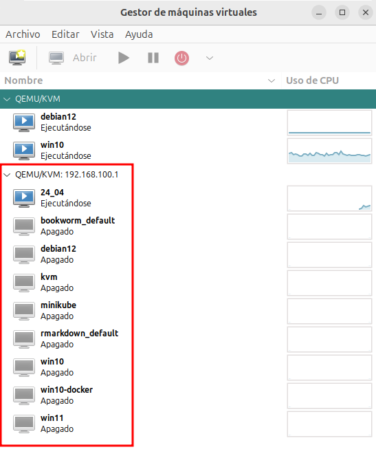

#  Conexión remota a libvirt

En virt-manager podemos crear una conexión que nos permita acceder al demonio libvirt que se está ejecutando en un servidor remoto.

Este método permite administrar un hipervisor QEMU/KVM en otro equipo a través de la red. Se usa en entornos de gestión centralizada o administración remota. Se pueden usar varios protocolos para el acceso, pero el más común es ssh.

Para realizar este tipo de conexión usaremos la siguiente URI: `qemu+ssh://<usuario>@<dirección  máquina remota>/system`.

Se va producir una conexión ssh entre la máquina cliente y el servidor donde se ejecuta libvirt. Por lo tanto hay que configurar las máquinas para que el usuario de la máquina "cliente" pueda acceder por ssh al servidor remoto con el usuario `usuario`, sin que se se le pida la contraseña.

## Configuración de ssh para el acceso sin contraseñas

Vamos a partir del siguiente escenario:

* Máquina **cliente** donde tenemos instalado virt-manager y vamos a conectarnos a una máquina remota.
* Maquina **servidor** donde se ejecuta el demonio de livbirt. el usuario de está máquina se llama `usuario`.

Para poder acceder por ssh al servidor remoto sin que nos pida contraseña es necesario otro método de autentificación. en este caso vamos a usar el método de calves ssh, para ello realizamos los siguiente pasos:

1. En la máquina cliente, xon un usuario sin privilegios, generamos un par de claves ssh, una pública y otra privada, para ello:

    ```
    $ ssh-keygen -t rsa
    ```

    Tendremos que indicar la ubicación y el nombre de las claves (se guardarán en el directorio `.ssh` en el home del usuario), se recomienda dejar el nombre que viene por defecto: `id_rsa.pub` la clave pública y `id_rsa` la clave privada.

    Además podremos definir una **Frase de paso (passphrase)**, una contraseña que se pedirá al usar la clave privada.

2. Para que con nuestra clave privada podamos autentificarnos al conectarnos con ssh con el servidor, tenemos que copiar nuestra clave pública en el servidor. Copiaremos el contenido de la clave pública en el fichero `~/.ssh/authorized_keys` del usuario del servidor con el que vamos a realizar la conexión. Para ello usamos la instrucción `ssh-copy-id` desde el cliente, indicando la clave pública que vamos a copiar:

    ```
    $ ssh-copy-id -i .ssh/id_rsa.pub usuario@<dirección del servidor>
    ```

3. Comprobamos que podemos hacer una conexión desde el cliente al servidor sin que me pida la contraseña:

    ```
    ssh usuario@<dirección del servidor>
    ```

## Configuración de virt-manager para una conexión remota

Desde virt-manager podemos crear una nueva conexión no privilegiada, eligiendo la opción **Archivo - Añadir conexión...**, eligiendo como **Hipervisor** la opción **QEMU/KVM** y eligiendo la opción **Conectar a anfitrión remoto por SSH** indicando el usuario y el nombre o dirección ip del servidor.

El usuario que indicamos será al que hemos copiado nuestra clave pública. Además si es un usuario sin privilegio deberá pertenecer al grupo `libvirt` en el servidor para poder gestionar recursos virtualizados en el modo privilegiado.


Si el servidor al que hemos conectado tenía ya creadas máquinas virtuales la podremos ver nuestra nueva conexión. Además todas las operaciones que hagamos en esta conexión se realizarán en el servidor remoto.


