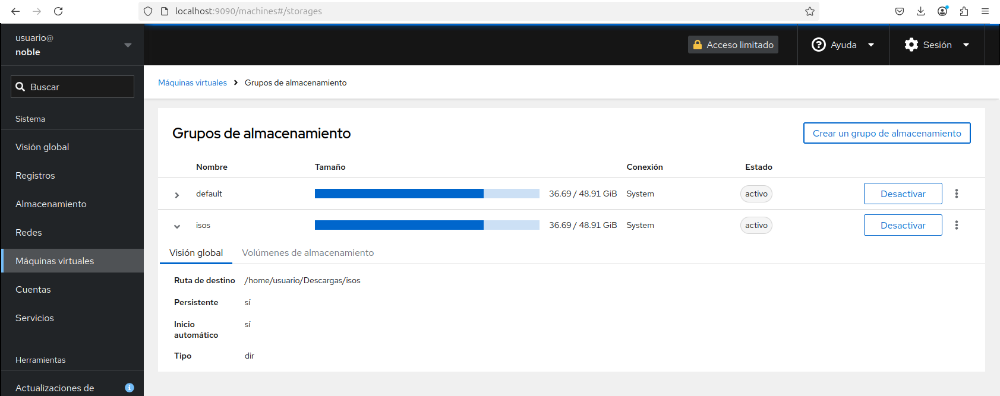
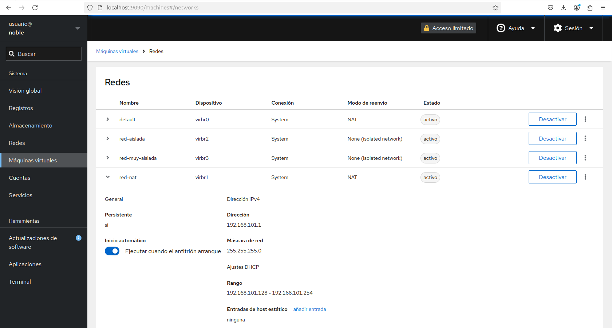

# Gestión de máquinas virtuales con Cockpit

**Cockpit** es una interfaz web ligera para administrar servidores Linux. Permite gestionar **servicios, almacenamiento, redes, contenedores y máquinas virtuales** de forma gráfica, sin necesidad de usar la terminal.  

Sus características principales son:

* Administración remota mediante navegador web.  
* Monitorización del uso de CPU, RAM, red y disco en tiempo real.  
* Gestión de usuarios, logs, actualizaciones y servicios del sistema.  
* Configuración de almacenamiento (LVM, RAID, discos, sistemas de archivos).  
* Soporte para contenedores (Docker y Podman).  
* Gestión de máquinas virtuales con KVM/Libvirt a través del complemento `cockpit-machines`.  

## Instalación de Cockpit


En sistemas basados en Debian/Ubuntu:  

```
sudo apt install cockpit cockpit-machines
```

Finalmente, accedemos desde un navegador en `https://<IP_DEL_SERVIDOR>:9090/`  

## Funcionalidades de Cockpit para KVM

* **Crear nuevas máquinas virtuales** con opciones de almacenamiento y red.  
* **Administrar discos, snapshots y configuraciones de las VMs**.  
* **Iniciar, detener, reiniciar y eliminar máquinas virtuales**.  
* **Conectar a la consola de una VM** sin necesidad de `virt-manager`.  
* **Gestionar redes y puentes virtuales (bridges)** para las VMs.  
* **Monitorizar el uso de CPU, RAM y almacenamiento de las VMs**.  

## Funcionalidad de cockpit para KVM

Cuando accedemos a la página de Cockpit y después de autentificarnos con nuestro usuario del sistema, podemos gestionar muchos aspectos  de nuestro servidor. En este apartado nos vamos a detener en las opciones que nos ofrece la opción **Máquinas virtuales**, que es la que nos posibilita gestionar nuestras máquinas:


Como vemos tenemos acceso a la gestión de nuestras máquinas virtuales. Vemos como además de encender o apagar las máquinas, podemos ejecutar distintas acciones y crear o importar nuevas máquinas.
Además podemos gestionar y crear nuestros grupos de almacenamiento:



Otras de las funcionalidades es obtener información de las redes que tenemos definidas, en este caso no nos deja crear nuevas redes:



Por último, si accedemos a una máquina virtual, tenemos toda la información de la máquina y podemos acceder a ella usando la consola serie:

