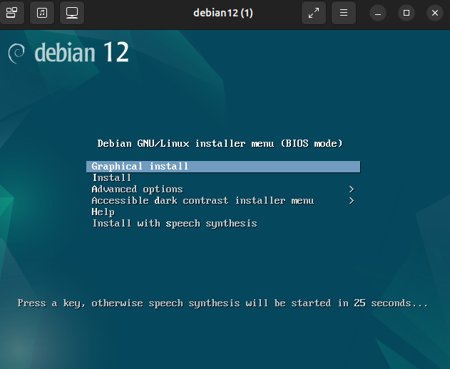

# Creación de máquinas virtuales con virt-install

Antes de crear nuestra primera máquina virtual, vamos a definir el concepto de **dominio**. En libvirt, un **dominio (domain)** es una instancia de una máquina virtual.

Vamos a crear las máquinas virtuales o dominios con la aplicación `virt-install`. Lo primero que tenemos que hacer es instalar el paquete `virtinst`, que además de este programa, tiene otras utilidades que iremos usando a los largo del curso.

```
usuario@kvm:~$ sudo apt install virtinst
```

## Creación de nuestra primera máquina virtual.

Vamos a crear una máquina con las siguientes características: se va a llamar `debian12`, se va a usar una ISO de la distribución GNU/Linux Debian 12, la variante de sistema operativo podemos poner `debian12`, el tamaño del disco será de 10 GB, la memoria RAM será de 1 GB y le vamos a asignar 1 vCPU. No vamos a indicar la red a la que se conecta ya que, por defecto, se conectará a la red predefinida `default`.

Tenemos que tener en cuenta dos cosas:

1. La red `default` debe estar activa.
2. Hemos bajado una imagen ISO para la instalación del sistema operativo y la tenemos guardado en el directorio `/var/lib/libvirt/images`.

Para crear la nueva máquina con esas características, ejecutamos con usuario sin privilegios:

```
usuario@kvm:~$ virt-install --connect qemu:///system \
			                --virt-type kvm \
			                --name debian12 \
			                --cdrom /var/lib/libvirt/images/debian-12.10.0-amd64-netinst.iso \
			                --os-variant debian12 \
			                --disk size=10 \
			                --memory 1024 \
			                --vcpus 1
```			 

La información que tenemos que proporcionar a `virt-install` para la creación de la nueva máquina virtual será la siguiente:

* El nombre de la máquina virtual (parámetro `--name`).
* El tipo de virtualización (parámetro `--virt-type`). en nuestro caso será `kvm`.
* En nuestro caso vamos a realizar una instalación desde un fichero ISO, por lo que tendremos que indicar que la nueva máquina tendrá un CDROM con la ISO que indiquemos (parámetro `--cdrom`).
* La variante del sistema operativo que vamos a utilizar (parámetro `--os-variant`). La variante del sistema operativo sirve para realizar una configuración por defecto de la máquina dependiendo del sistema que vamos a instalar. Para obtener la lista de variantes de sistemas operativos, podemos ejecutar la siguiente instrucción:

    ```
    usuario@kvm:~$ virt-install --os-variant list
    ```

    Si quieres más información sobre las variantes puedes instalar el paquete `libosinfo-bin` y ejecutar la siguiente instrucción:

    ```
    usuario@kvm:~$ sudo apt install libosinfo-bin
    usuario@kvm:~$ osinfo-query os
    ```
* El tamaño del disco (parámetro `--disk size`). Se creará un fichero con la imagen del disco que se guardará en `/var/lib/libvirt/images`.
* La cantidad de memoria RAM (parámetro `--memory`).
* La cantidad de vCPU asignadas a la máquina (parámetro `--vcpus`).

Podemos indicar muchos más parámetros a la hora de crear la nueva máquina. Puedes obtener toda la información en la [documentación oficial](https://github.com/virt-manager/virt-manager/blob/main/man/virt-install.rst) de la aplicación. Iremos usando, a lo largo del curso, diferentes parámetros de esta herramienta.

A continuación, se iniciará la máquina y se abrirá la aplicación `virt-viewer` que nos permitirá conectarnos por VNC/SPICE a la máquina para que realicemos la instalación:



