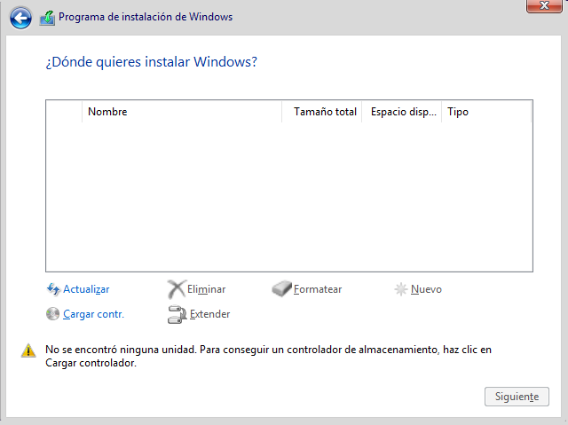
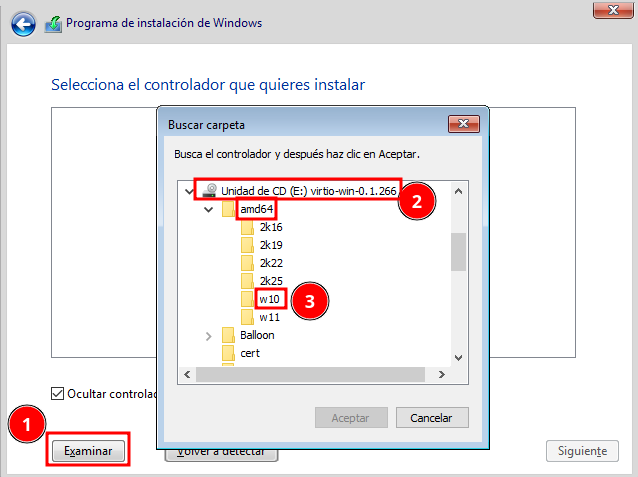
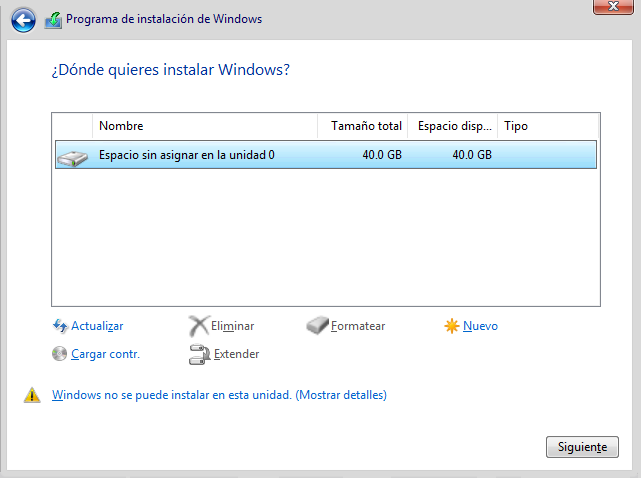

# Creación de máquinas virtuales Windows con virt-install

De forma similar a cómo hemos creado una máquina virtual con el sistema operativo Linux, podemos crear una máquina Windows. Tenemos que tener en cuenta que Windows no tiene soporte nativo para dispositivos VirtIO. Por lo tanto, a la hora de crear una máquina virtual Windows tendremos que añadir los controladores de dispositivos (drivers) necesarios para que Windows identifique los dispositivos VirtIO que definamos en la máquina virtual.

En este caso, el proyecto Fedora proporciona controladores de dispositivos de software libre para VirtIO en Windows.

## ISO de los controladores de dispositivo VirtIO para Windows

Podemos bajar la última versión de los drivers VirtIO para Windows y guardarla en el directorio de imágenes, donde también hemos guardado la imagen ISO para instalar Windows 10:

```
usuario@kvm:~$ wget https://fedorapeople.org/groups/virt/virtio-win/direct-downloads/stable-virtio/virtio-win.iso
usuario@kvm:~$ sudo mv virtio-win.iso /var/lib/libvirt/images
```

## Creación de la máquina virtual


```
usuario@kvm:~$ virt-install --connect qemu:///system \
			                --virt-type kvm \
			                --name windows10 \
			                --cdrom /var/lib/libvirt/images/Win10_22H2_Spanish_x64v1.iso \
			                --os-variant win10 \
			                --disk size=40,bus=virtio \
			                --disk /var/lib/libvirt/images/virtio-win.iso,device=cdrom \
			                --network=default,model=virtio \
			                --memory 2048 \
			                --vcpus 2
```
Hemos añadido la siguiente configuración:

* `--disk size=40,bus=virtio`: En la declaración del disco indicamos el controlador VirtIO.
* `--disk /var/lib/libvirt/images/virtio-win.iso,device=cdrom`: Añadimos un segundo CDROM con la imagen ISO de los drivers VirtIO, usamos el parámetro `device=cdrom`.
* `--network=default,model=virtio`: De la misma manera, indicamos el modelo de tarjeta de red como VirtIO.

## Comenzamos la instalación

Se inicia el programa `virt-viewer` y podemos comenzar la instalación, hasta que llegamos a la pantalla donde tenemos que escoger el disco duro donde vamos a realizar la instalación.



Como vemos no se puede detectar el disco duro, ya que Windows no puede reconocer inicialmente el controlador VirtIO. Vamos a cargar los controladores de dispositivo VirtIO que necesitamos del CDROM que hemos montado:

Elegimos la opción *Cargar contr.*, le damos a *Examinar* y elegimos del CDROM donde tenemos los drivers VirtIO la carpeta de nuestra arquitectura (*amd64*) y la versión de Windows.



Y ya podemos continuar con la instalación de Windows porque ya detecta el disco duro:



## Configuración de los drivers VirtIO

Una vez que hemos realizado la instalación del sistema operativo, podemos comprobar que la máquina no tiene acceso a internet, ya que tenemos que cargar los drivers de la tarjeta de red VirtIO que hemos configurado, además de otros dispositivos:

* **Controladora de red**: Accedemos a **Administrador de dispositivos** y actualizamos el controlador del dispositivo **Controladora Ethernet**. Escogemos la unidad del CDROM donde hemos montado los drivers VirtIO y elegimos la opción **Incluir subcarpetas** para que la busque de manera recursiva (los drivers de la tarjeta de red se encuentra en la carpeta `NetKVM\<carpeta con el nombre de tu versión de windows>\amd64`).
* **Controladora simple de comunicaciones PCI**, que corresponde a un dispositivo **VirtIO Serial Driver**, que es un controlador de comunicaciones serie.
* **Dispositivo PCI**, que corresponde a un dispositivo **VirtIO Balloon Driver**, que es un controlador que permite la gestión dinámica de la memoria en máquinas virtuales bajo KVM/QEMU.

## Instalación de Windows 11

La instalación de Windows 11, es similar a la que hemos visto anteriormente con Windows 10, pero teniendo en cuenta algunas consideraciones:

* Evidentemente, necesitamos guardar la imagen ISO de Windows 11 en el directorio de imágenes.
* Cuando indicamos como variante de sistema operativo la opción *win11*, se va a configurar la máquina virtual con los elementos hardware necesarios para la instalación de este sistema operativo. En particular, se añade un dispositivo TPM. El TPM (Trusted Platform Module) es un chip de seguridad que se encuentra en la placa base de los ordenadores modernos. Su función principal es proporcionar un entorno seguro para almacenar claves de cifrado, credenciales y otros datos sensibles. Microsoft exige TPM versión 2.0 como requisito obligatorio para la instalación de Windows 11 debido a motivos de seguridad. En KVM/libvirt se puede emular el chip TPM para que el sistema invitado (por ejemplo, Windows 11) lo detecte y pueda instalarse sin problemas.
* Durante la instalación del sistema, tendremos que cargar los controladores VirtIO para que se detecte el disco duro, al igual que hicimos en Windows 10. Pero además, para la instalación del sistema es necesario que estar conectado a internet, por lo tanto, durante el proceso de instalación, también tendremos que cargar los drivers VirtIO de la tarjeta de red para que se tenga conectividad.
* La instrucción que vamos a usar para la instalación sería:

	```
	usuario@kvm:~$ virt-install --connect qemu:///system \
				                --virt-type kvm \
				                --name windows11 \
				                --cdrom /var/lib/libvirt/images/Win11_24H2_Spanish_x64.iso \
				                --os-variant win11 \
				                --disk size=40,bus=virtio \
				                --disk /var/lib/libvirt/images/virtio-win.iso,device=cdrom \
				                --network=default,model=virtio \
				                --memory 4096 \
				                --vcpus 2
	```

* Al configurar la máquina Windows 11 se va a usar UEFI en lugar de BIOS. En este caso, se le asigna un archivo de NVRAM que actúa como memoria persistente para almacenar configuraciones de arranque y otros parámetros. **NVRAM (Non-Volatile Random Access Memory)** es una memoria no volátil que almacena configuraciones del firmware UEFI, como variables de arranque y configuraciones específicas del sistema. Cuando intentas eliminar una máquina virtual con `virsh undefine`, libvirt protege el archivo NVRAM para evitar pérdidas accidentales. Por eso, necesitas usar la opción `--nvram` para eliminarlo junto con la máquina virtual o `--keep-nvram` si quieres conservarlo.

	```
	usuario@kvm:~$ virsh undefine windows11 --nvram
	```
