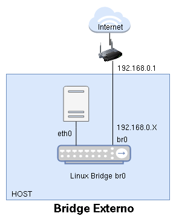
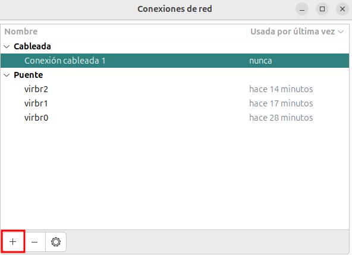
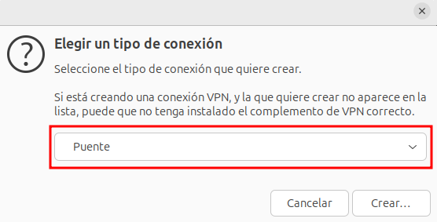
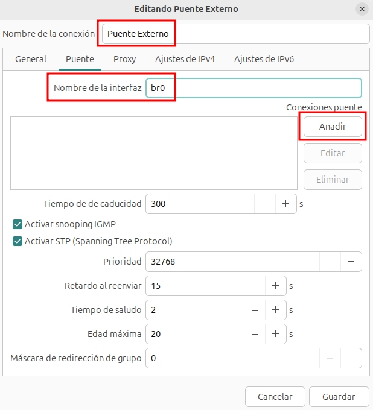
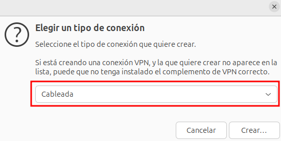
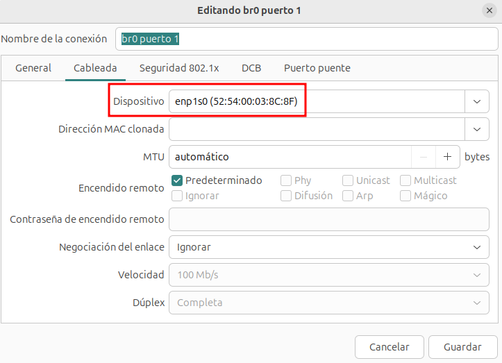
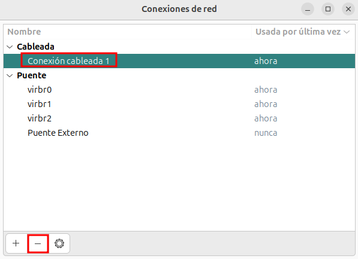
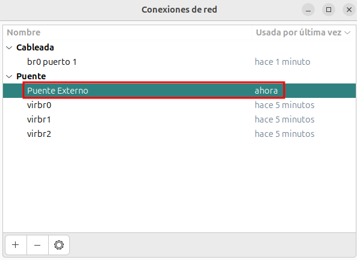

# Creación de un puente externo con Linux Bridge

Un bridge externo es un bridge virtual que estará conectado al router de la red local. El bridge se creará en el servidor donde estamos virtualizando (host). El host estará conectado a este bridge para tener conectividad al exterior. Veamos un esquema:



* El bridge que vamos a crear lo vamos a llamar `br0`.
* En el host aparecerá una interfaz de red con el mismo nombre que representa la conexión al bridge. Está interfaz de red se configurará de forma estática o dinámica (si la red local tiene un servidor DHCP).
* En el ejemplo vemos que la interfaz física de red es `eth0` que estará conectada a `br0` para que el host tenga conectividad al exterior. Esa interfaz de red no tendrá asignada dirección IP.
* Posteriormente, veremos como podemos conectar las máquinas virtuales a este bridge de tal manera que tomaran direcciones IP en el mismo direccionamiento que el host.

**Nota: Si conectamos al bridge una interfaz de tipo wifi podemos tener problemas de conectividad. No todas las tarjetas inalámbricas permiten la conexión a puentes virtuales.**

## Creación de un bridge externo con NetworkManager

**NetworkManager** es una utilidad de gráfica para simplificar el uso de redes en sistemas Linux. Normalmente, la tenemos instaladas con sistemas Linux con entornos gráficos como Gnome. Junto a esa utilidad tenemos otra que se puede ejecutar con el comando `nm-connection-editor`, y que se llama **Configuración de redes**:


Si lo ejecutamos accedemos a la siguiente pantalla:



Donde vemos la conexión de red cableada (o de wifi) que tenemos y los bridges virtuales que se han creado cuando hemos estado trabajando con las redes privadas. Pulsando el botón **+**, podemos de alta nueva conexión. Añadiremos una conexión de tipo **Puente**:



Y podemos indicar el nombre de la conexión, el nombre del puente que estamos creando, y a continuación vamos a añadirle una conexión al bridge que será la interfaz de red física del host que está actualmente conectada al exterior.



Añadimos una conexión **Cableada** que será la interfaz física del host (en mi caso `enp1s0`):





Finalmente, borramos la conexión cableada que tenemos actualmente:



Y en unos segundos, se conectará de forma automática a la conexión **Puente Externo**:

 

## Creación de un bridge externo con ifupdown

Si estamos trabajando en un servidor con Linux Debian instalado y no tenemos instalado NetworkManager, la configuración se hará directamente en el fichero de configuración de red `/etc/network/intefaces`. Vamos a suponer que la interfaz del equipo es `enp1s0`:

```
auto lo
iface lo inet loopback

auto enp1s0
iface enp1s0 inet manual

auto br0
iface br0 inet dhcp
        bridge-ports enp1s0
```

Donde vemos como hemos configurado la interfaz física `enp1s0` de tipo `manual` para que no tome direccionamiento. Además, hemos declarado nuestro puente `br0` para que tome direccionamiento de forma dinámica y hemos indicado que tendrá una interfaz conectada (`bridge-ports`) que será la física (`enp1s0`).

Finalmente, reiniciamos la red como superusuario:

```
usuario@kvm~$ sudo ifdown enp1s0
usuario@kvm~$ sudo systemctl restart networking.service
```


## Creación de un bridge externo con netplan

Si tenemos un sistema que tenga `netplan`, por ejemplo Ubuntu, vamos a configurar el fichero `/etc/netplan/01-network-manager-all.yaml` de la siguiente forma:

```
network:
  version: 2
  renderer: NetworkManager
  ethernets:
    enp1s0:
      dhcp4: no
  bridges:
    br0:
      dhcp4: yes
      interfaces:
             - enp1s0
```

Y reiniciamos la red ejecutando:

```
usuario@kvm~$ sudo netplan apply
```

## Comprobación de funcionamiento

Independientemente de la opción que hayamos escogido, una vez realizada la configuración podemos comprobar si se ha creado un bridge `br0` que ha tomado el direccionamiento adecuado y que la interfaz de nuestro ordenador está conectado a él:

```
usuario@kvm~$ ip a
...
2: enp1s0: <BROADCAST,MULTICAST,UP,LOWER_UP> mtu 1500 qdisc pfifo_fast master br0 state UP group default qlen 1000
    link/ether 52:54:00:22:d7:3f brd ff:ff:ff:ff:ff:ff
3: br0: <BROADCAST,MULTICAST,UP,LOWER_UP> mtu 1500 qdisc noqueue state UP group default qlen 1000
    link/ether 92:d8:69:79:60:69 brd ff:ff:ff:ff:ff:ff
    inet 192.168.121.169/24 brd 192.168.121.255 scope global dynamic br0
       valid_lft 3595sec preferred_lft 3595sec
```

Podemos comprobar los puentes que tenemos creados y las interfaces que están conectados a él, ejecutando la siguiente instrucción:

```
usuario@kvm~$ sudo brctl show
bridge name	bridge id		STP enabled	interfaces
br0		8000.7eb448933f70	no		enp1s0
```