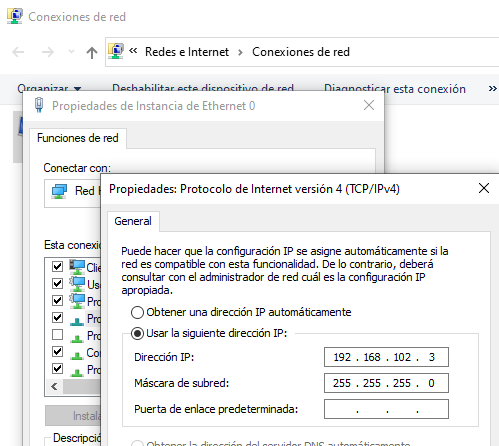
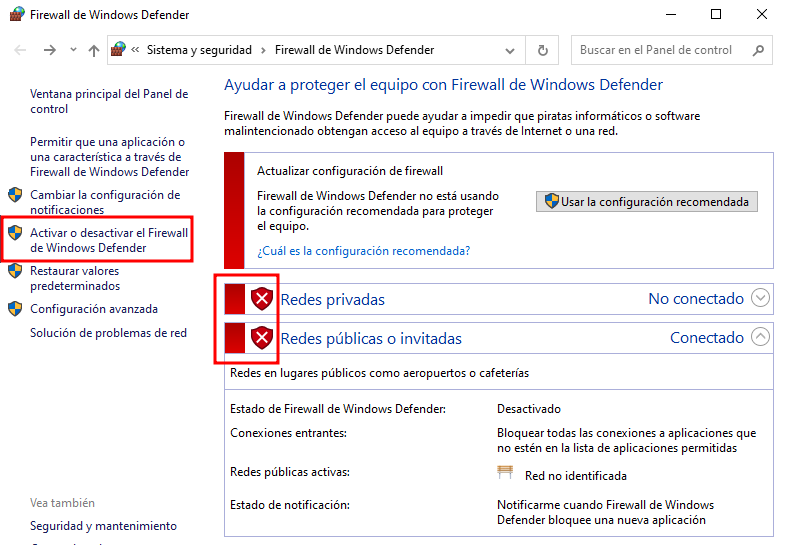
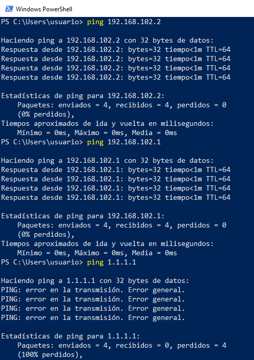
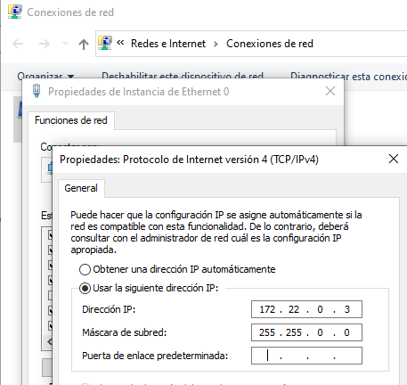
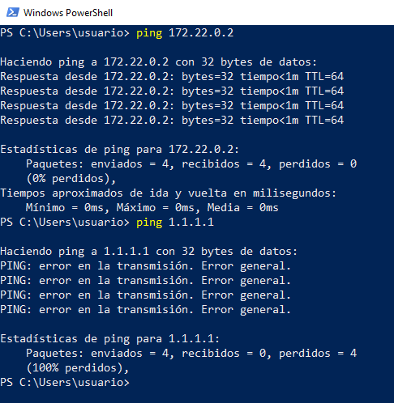

# Ejemplo 2: Trabajando con redes virtuales privadas

En este apartado vamos a configurar las dos máquinas con la que estamos trabajando con distintas configuraciones de red utilizando las redes virtuales que hemos creado.

## Trabajando con la red de tipo NAT

En primer lugar vamos a cambiar la configuración de la máquina Linux para conectarla a la red de tipo NAT llamada `red-nat` que hemos creado anteriormente (recordamos que el direccionamiento que pusimos para esta red es `192.168.101.0/24`). De la misma manera que en el apartado anterior, desconectamos la la interfaz de red de la red actual y la conectamos a la nueva red (recuerda que este cambio no se puede hacer con la máquina funcionando, si lo hacemos tendrá efecto tras un reinicio):

```
usuario@kvm~$ virsh domiflist debian12
usuario@kvm~$ virsh detach-interface debian12 network --mac xx:xx:xx:xx:xx:xx --persistent 
usuario@kvm~$ virsh attach-interface debian12 network red_nat --model virtio --persistent
```

Recuerda que también podemos hacer la conexión indicando al puente donde nos conectamos:

```
usuario@kvm~$ virsh attach-interface debian12 bridge virbr1 --model virtio --persistent
```

Accedemos a la máquina virtual y comprobamos el direccionamiento que ha tomado:

```
usuario@debian12:~$ ip a
...
2: enp1s0: <BROADCAST,MULTICAST,UP,LOWER_UP> mtu 1500 qdisc fq_codel state UP group default qlen 1000
    link/ether 52:54:00:9f:aa:18 brd ff:ff:ff:ff:ff:ff
    inet 192.168.101.152/24 brd 192.168.101.255 scope global dynamic enp1s0
    ...
```

También podemos comprobar que tenemos acceso a internet sin ningún problema.

## Trabajando con la red aislada

A continuación, vamos a conectar las dos máquinas a la red aislada llamada `red-aislada`, recordamos que habíamos deshabilitado el servidor DHCP y que en este caso comprobaremos que el host no hace la función de router con el mecanismo de NAT. Para ello vamos a realizar las siguientes configuraciones:

* Vamos a modificar la configuración de la máquina Linux para conectarla a la red aislada, y posteriormente configuramos la interfaz de red de forma estática con el direccionamiento que habíamos configurado en la red `red-aislada` que era `192.168.102.0/24`, tenemos que recordar que en esta red está conectada el host con la dirección `192.168.102.1`.

    ```
    usuario@kvm~$ virsh detach-interface debian12 network --mac xx:xx:xx:xx:xx:xx --persistent 
    usuario@kvm~$ virsh attach-interface debian12 network red_aislada --model virtio --persistent
    ```

    La configuración de red la hacemos en el fichero `/etc/network/interfaces`:

    ```
    ...
    allow-hotplug enp1s0
    iface enp1s0 inet static
        address 192.168.102.2/24
    ```
    Reiniciamos la red y comprobamos que ha tomado la dirección de forma correcta:

    ```
    usuario@debian12:~$ sudo systemctl restart networking.service 
    usuario@debian12:~$ ip a
    ...
    3: enp1s0: <BROADCAST,MULTICAST,UP,LOWER_UP> mtu 1500 qdisc fq_codel state UP group default qlen 1000
        link/ether 52:54:00:ce:bf:4e brd ff:ff:ff:ff:ff:ff
        inet 192.168.102.2/24 brd 192.168.102.255 scope global enp1s0
    ...
    ```

* Realizamos la misma operación en la máquina Windows. Además deshabilitamos el cortafuegos para que nos permita hacer las posteriores comprobaciones:

    ```
    usuario@kvm~$ virsh detach-interface windows10 network --mac xx:xx:xx:xx:xx:xx --persistent 
    usuario@kvm~$ virsh attach-interface windows10 network red_aislada --model virtio --persistent
    ```
    
    

    

A continuación, vamos a realizar algunas comprobaciones:

* Desde la máquina Linux tenemos conectividad con la máquina Windows y con el host, pero no tenemos conectividad con el exterior:

    ```
    usuario@debian12:~$ ping 192.168.102.3
    PING 192.168.102.3 (192.168.102.3) 56(84) bytes of data.
    64 bytes from 192.168.102.3: icmp_seq=1 ttl=128 time=11.7 ms
    ...
    usuario@debian12:~$ ping 192.168.102.1
    PING 192.168.102.3 (192.168.102.1) 56(84) bytes of data.
    64 bytes from 192.168.102.1: icmp_seq=1 ttl=128 time=11.7 ms
    ...
    usuario@debian12:~$ ping 1.1.1.1
    ping: connect: La red es inaccesible
    ```

* Del mismo modo, desde la máquina Windows tenemos conectividad con la máquina Linux y el host, pero tampoco con el exterior:

    

## Trabajando con la red muy aislada

En este último ejemplo modificamos la configuración de las interfaces de red de las máquinas para conectarlas con la red muy aislada llamada `red-muy-aislada`. En este caso, el host no está conectado a esta red y podemos utilizar el direccionamiento que queramos, teniendo en cuenta que las dos máquinas tienen que tener el mismo para que tengan conectividad. En este ejemplo vamos a usar el direccionamiento `172.22.0.0/16`.

*  Modificamos la configuración de la máquina Linux para conectarla a la red muy aislada, y configuramos la interfaz de red de forma estática con el direccionamiento que hemos indicado:

    ```
    usuario@kvm~$ virsh detach-interface debian12 network --mac xx:xx:xx:xx:xx:xx --persistent 
    usuario@kvm~$ virsh attach-interface debian12 network red_muy_aislada --model virtio --persistent
    ```

    La configuración de red la hacemos en el fichero `/etc/network/interfaces`:

    ```
    ...
    allow-hotplug enp1s0
    iface enp1s0 inet static
        address 172.22.0.2/24
    ```
    Reiniciamos la red y comprobamos que ha tomado la dirección de forma correcta:

    ```
    usuario@debian12:~$ sudo systemctl restart networking.service 
    usuario@debian12:~$ ip a
    ...
    3: enp1s0: <BROADCAST,MULTICAST,UP,LOWER_UP> mtu 1500 qdisc fq_codel state UP group default qlen 1000
        link/ether 52:54:00:ce:bf:4e brd ff:ff:ff:ff:ff:ff
        inet 172.22.0.2/24 brd 192.168.102.255 scope global enp1s0
    ...
    ```

* En la máquina Windows hacemos la misma operación:

    ```
    usuario@kvm~$ virsh detach-interface windows10 network --mac xx:xx:xx:xx:xx:xx --persistent 
    usuario@kvm~$ virsh attach-interface windows10 network red_muy_aislada --model virtio --persistent
    ```

    

* Y finalmente comprobamos que tenemos conectividad entre las máquinas pero no tenemos conectividad con el exterior.

    ```
    usuario@debian12:~$ ping 172.22.0.3
    PING 172.22.0.3 (172.22.0.3) 56(84) bytes of data.
    64 bytes from 172.22.0.3: icmp_seq=1 ttl=128 time=2.63 ms
    ...
    usuario@debian12:~$ ping 1.1.1.1
    ping: connect: La red es inaccesible
    ```

    

